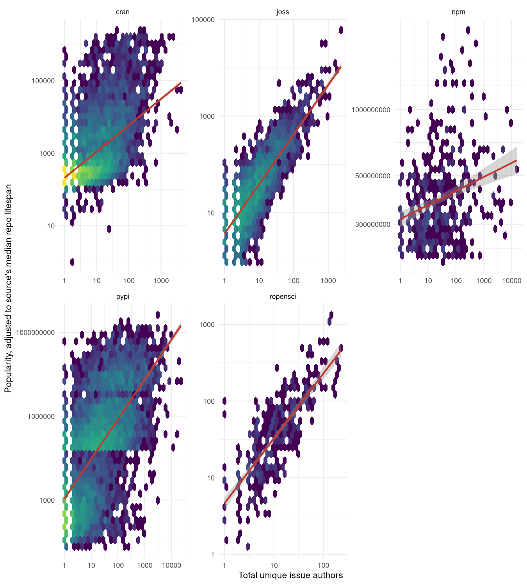
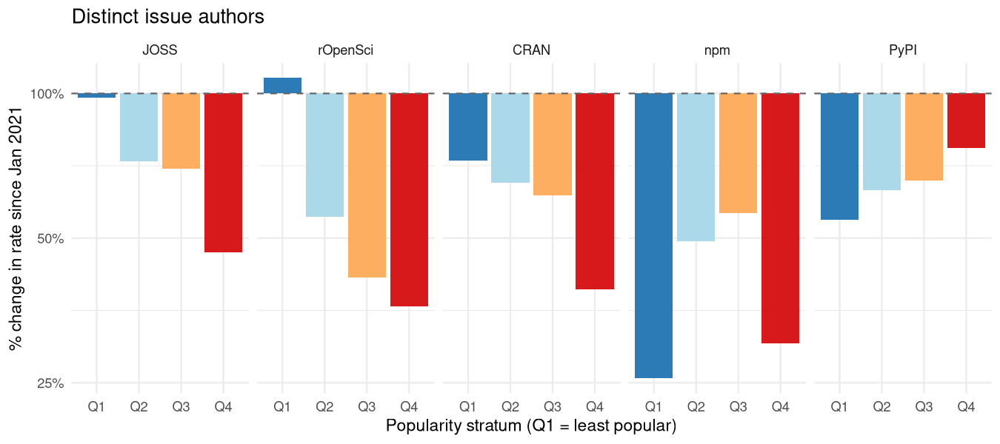
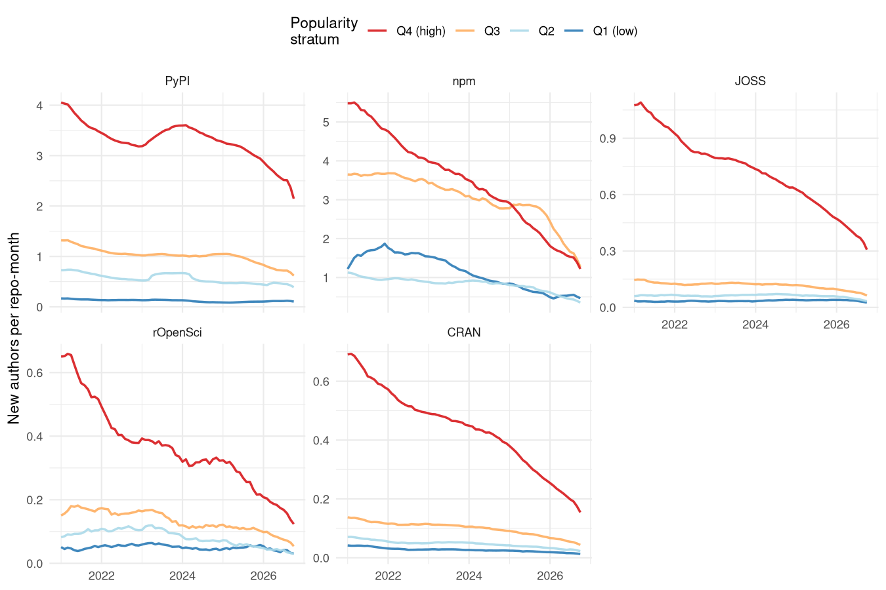
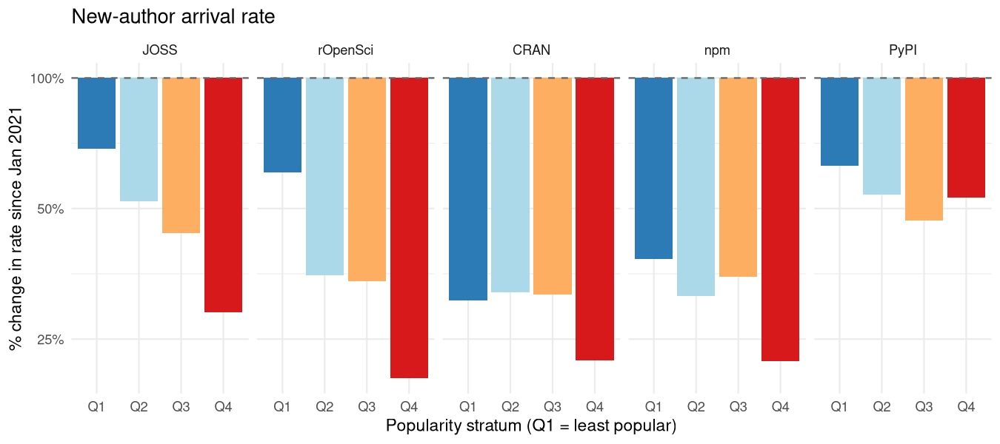
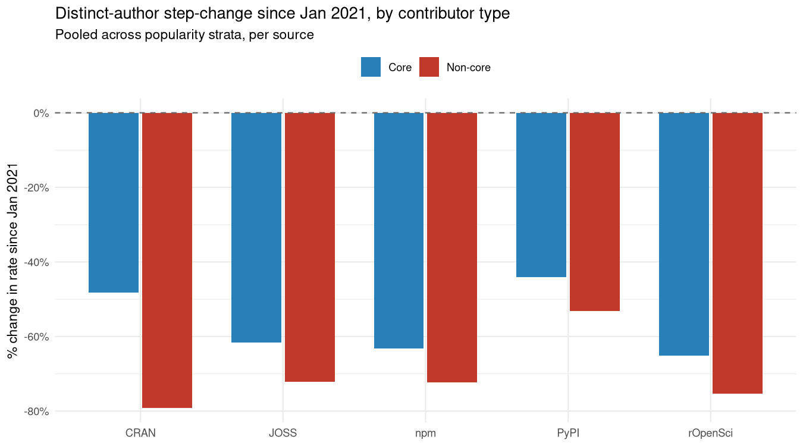
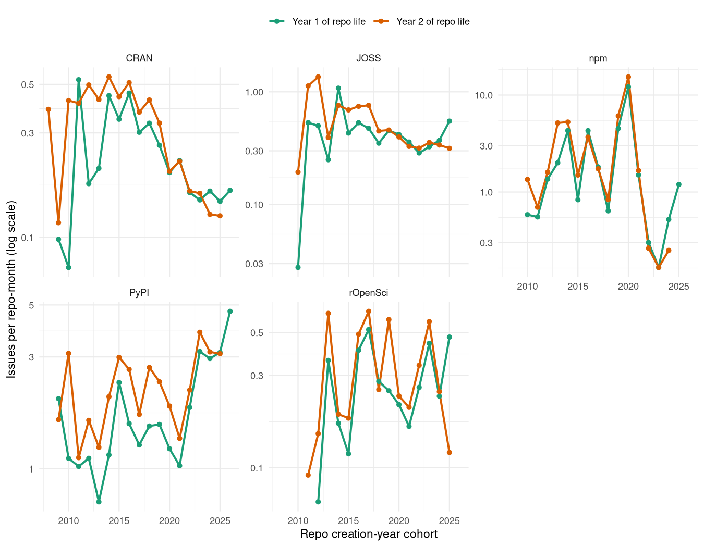

# Coding Alone

In 1995, Robert Putnam noticed that more Americans were bowling than
ever before, but the growth was in solo or casual bowling at the expense
of organised, collective bowling He argued that this was reflective of a
broader collapse of associational habits which used to knit Americans
into overlapping social groups. Local clubs, unions, congregations,
leagues had been quietly hollowing out for a generation, not because
people had lost interest in the underlying activities, but because
they’d stopped doing them together ([Putnam
1995](#ref-putnam1995bowlingalone),
[2000](#ref-putnam2000bowlingalone)). The incidental organizational
structure of bowling leagues turned out to have been key to the way a
potentially solitary pastime contributed to social cohesion.

Open-source software has its own version of a league: public
repositories, with a few core maintainers and shifting casts of
outsiders who ask questions, report bugs, or leave comments. These
communities of contributors guide and nurture ongoing software
development. People still write code, but this analysis shows that the
collective structures that have supported and sustained that writing are
changing dramtically. Public software repositories are changing from
places of social coherence and cohesion to become more like mere mirrors
of a single person’s work.

## Why does this matter?

Maybe software coded by increasingly isolated individuals will be just a
good as previous software coded by larger communities building on one
another’s ideas? Maybe a bunch of individuals with large enough budgets
for billions on AI tokens will be able to usher in a new golden age of
genius software? It’s obviously helpful at the outset to try to figure
out whether that’s likely to happen or not.

The first problem in doing that is that good software is not easy to
define. But at least for open-source software, popularity can generally
be presumed to reflect quality. Popular open-source software can
generally be presumed to be good (even though lots of really good
software may go unnoticed). And popularity can be measured, generally by
numbers of downloads, as well as by metrics like numbers of times people
have “starred” software repositories on GitHub.

All of the following analyses use random selections of repositories from
several common software distribution systems, including [npm for
Javascript](https://npmjs.com), [PyPI for Python](pypi.org), [CRAN for
R](https://cran.r-project.org), and two GitHub-based software review
organizations, [JOSS (the Journal of Open-Source
Software)](https://joss.theoj.org), and
[rOpenSci](https://ropensci.org). Data extracted for each of these can
show whether larger communities help produce better software, as
measured through popularity.

Relationships between community size and popularity are of course
complicated by the fact that both tend to change and interact over time
(ideally through growing together). Such mutual interactions can easily
be statistically accounted for, to estimate the effects of community
size on repository popularity independent of any influence of repository
age on either of those measures. And doing that reveals the
relationships shown in the following figure:

Figure 1: Relationships between numbers of authors and repository
popularity, accounting for the effects of repository age on both. Large
communities are very strongly associated with software popularity in all
cases.

Good software - as measured by popularity - is overwhelmingly produced
by larger communities. This relationship is of course purely
correlative, and can say nothing about whether larger communities
actually *cause* software quality to increase. But it is nevertheless
sufficient to clearly show why this matters: Software produced by
smaller communities tends to be significantly less popular. This
suggests that any decreases in the sizes of communities producing
software will likely be associated with decreases in software
popularity, and quite likely decreases in software quality.

To answer the question this section posed: These analyses matter because
good software emerges from large communities, and anything that works to
reduce community size will also work to reduce software quality. The
rest of this analyses provides various insights in to what appears to be
a comprehensive collapse of open-source communities.

### What was measured

All data are taken from GitHub, primarily as measures of interaction
with software repositories through “issues”. Issues are the place for
anybody to ask questions of software authors, to report bugs, or to
request new features. A corpus of repositories was taken from the five
sources described above.

Analyses included every repository reviewed by
[JOSS](https://joss.theoj.org) and [rOpenSci](https://ropensci.org),
every package currently on [CRAN](https://cran.r-project.org), and
samples from the other three. Samples were stratified by popularity to
ensure even sampling and representation regardless of popularity. In
total, 3,139,779 issues were analysed across 52,461 repositories.

More popular or prominent repositories attract greater interaction,
resulting in issues being opened more frequently, and from a wider
community. To account for the effects of repository popularity, most of
the results are represented for four popularity strata, taken as
quartiles on a logarithmic popularity scale. The lowest quartile,
denoted “Q1”, represents the least popular repositories. Because these
generally strongly outnumber popular repositories, these Q1 values may
be generally interpreted to reflect the majority of all repositories.
The “Q4” repositories are the outlying superstar repositories with
enormous numbers of downloads and hundreds of people opening issues. A
few additional statistics were also extracted, and are described
alongside the main analyses.

#### But what about pull requests?

GitHub also implements “pull requests”, which allow people to upload
their own code changes and request that they be “merged” with the
repository’s code. Pull requests are not the place for most people who
simply want to ask questions, or to request that software be adapted or
modified for their own particular purposes. Pull requests from non-core
contributors generally follow explicit requests in issues. I’ll briefly
examine pull requests at the end of this analysis. In the meantime, it’s
sufficient to note that pull requests represent a very minor portion
(always \< 10%) of all interactions with repositories on GitHub, with
the rest coming through issues.

The focus of these analyses is on the primary point of community
interactions with open-source software, and these have always been
issues and not pull requests.

------------------------------------------------------------------------

## Main Findings

### Finding \#1: People are coding less

Although the main focus here is on the demise of open-source
communities, all data also reveal a pervasive decline in coding activity
in general. The most direct measures of coding activity are the creation
of new repositories, and numbers of commits in each. Time series of
these two statistics are shown in the following two panels. Both of
these show trends common to most results that follow, with variable
development up until 2020-2021, followed by more progressive declines.
Reflecting these general patterns, many of the results below only show
time series from 2021 onwards. Comparisons are also made as “step
changes” between January 2021 and the present (Oct 2026)

Figure 2: Rates of creation of new repos (top panel, as relative monthly
percentages) and of commits per month (bottom). All rates are 12-month
trailing averages.

Decreases in repository creation could of course simply reflect people
moving towards alternative code hosting sites. other than GitHub. Such
effects are not considered further here, but all analyses that follow
are derived from software which (still) identifies GitHub as its primary
source, and are therefore independent of whether or not people are
abandoning GitHub for alternative sites. The rates of monthly commits of
[Figure 2](#fig-commit-rate-plot) are an example. Most of these rates
have declined over the past few years, and directly reflect genuine
declines observed among those people still active on GitHub.

### Finding \#2: There Are Fewer Contributors

There are several ways to measures numbers of contributors to
open-source software. Source code itself provides one of the most direct
measures, generally through tracking who made each change. Code-hosting
platforms provide a different approach, through data on repository
issues. Anybody (with an account) can open an issue to ask a simple
question. Many who do may not necessarily end up directly contributing
to code at all, while almost all non-core developers who do contribute
code start their first interactions via issues. Data on issues therefore
offers more inclusive insights into open-source communities than data on
direct code contributors.

[Figure 3](#fig-trend-plots) shows numbers of unique people opening new
issues on repositories for the five software ecosystems. All counts are
standardised to numbers of new issues per repository per month. All of
these patterns reveal consistent changes either side of around 2020. And
all of them have progressively decreased since that time.

Figure 3: Numbers of distinct authors opening new issues, measured per
repository and per month.

For each software source, lines are shown for the four distributional
quartiles described above. “Q4” represents the relatively few extremely
popular packages, while “Q1” is the quartile of lowest popularity. (And
these quartiles are defined on a logarithmic scale, so there are far
more packages in Q1 than in Q4.)

The next figure ([Figure 4](#fig-step-change-authors)) shows average
declines since Jan 2021 for each software ecosystem and for each
popularity quartile. Many of these declines are more pronounced for the
most popular software (Q4), although PyPI shows the opposite trend, with
decreases in numbers of unique issue authors being less severe for the
most popular packages, while npm shows an intermediate pattern.

Figure 4: Changes in numbers of unique issue authors per
repository-month since 2021. Values are shown for four popularity
quartiles, from lowest (Q1) to highest (Q4).

Total numbers of comments on each issue show a similar pattern
([Figure 5](#fig-step-change-commits)), with similarly reversed trends
for PyPi as well as npm. Taken together, these two figures reveal both
numbers of issue authors and numbers of comments per issue have declined
severely in all software systems over the past few years. Only for
python packages in PyPI have declines been less severe for the most
popular packages. In all other systems, declines have either been
uniformly more severe for more popular packages or, for npm, displayed
mixed patterns with the most severe declines at both ends of the
popularity spectrum.

Figure 5: Changes in numbers of comments since 2021, as for previous
figure.

Relative differences in all statistics to this point are quantified in
the following table of percentage changes since Jan 2021. Although these
values show clear declines in coding itself, both in rates of repository
creation and commits, declines are considerably more severe for metrics
of community size. Coding is decreasing, but community interactions are
shrinking even faster.

| Source | Repo creation (%) | Commits (%) | Distinct Authors (%) | Issue Comments (%) |
|:---|---:|---:|---:|---:|
| JOSS | \- | -56% | -61% | -83% |
| rOpenSci | \- | -54% | -61% | -71% |
| CRAN | -38% | -49% | -64% | -78% |
| npm | -55% | -22% | -63% | -70% |
| PyPI | -29% | -18% | -36% | -50% |

Percentage changes in statistics of Figs. 1-4, estimated from linear
regressions fitted to all data from Jan 2021 across all popularity
strata (Repository creation for both JOSS and rOpenSci generally only
occurs following rigorous review processes, and so values for these two
can’t really be directly compared with the other sources, and are likely
affected by additional constraints and influences.) {.table
.caption-top}

------------------------------------------------------------------------

### Finding \#3: New Authors Are Not Arriving

The rates at which new authors of GitHub issues appear have also
progressively decreased across all software systems
([Figure 6](#fig-new-author-rate)). In 17 of those 20 combinations of
software source-by-popularity stratum, the new-arrival rate has fallen
by *more* than overall author density has, meaning the decline
documented above isn’t simply existing regulars posting a little less
often; it’s disproportionately a shrinking supply of people showing up
for the first time at all.

Figure 6: Rates of arrival of new issue authors per repository-month.

The following plot converts those absolute measures to relative scales,
to enable comparison of relative rates of change across the popularity
quartiles for each software source. In almost all cases, decreases in
arrival rates of new authors are most severe for the most popular
packages.

Figure 7: Changes in rates of new-author arrival since 2021, as for
previous figures.

An alternative way of examining these decreases in rates of arrival are
in terms of intervals between the arrival of each sequential pair of new
authors ([Figure 8](#fig-new-author-intervals)).

Figure 8: Intervals in days between successive arrival of new authors.

These rates have also uniformly increased over the past few years. They
are also notably far higher for [CRAN](https://cran.r-project.org),
[JOSS](https://joss.theoj.org), and [rOpenSci](https://ropensci.org), in
which new authors now arrive more than once per month only for the most
popular packages. Only PyPi appears to not suffer this trend, with
intervals between the arrival of new authors progressively decreasing
over the past couple of years.

### Finding \#4: Spiralling Towards Solitude

For each person contributing to a repository, GitHub also provides a
measure of their relative overall contribution, measured as numbers of
commits to source code. These relative contribution values were used to
arbitrarily distinguish core contributors to a repository as those
contributing a cumulative total of 99% of all commits. Non-core
contributors were then identified as those contributing less than 1% of
the cumulative total. While this threshold is arbitrary, none of the
results or conclusions that follow are qualitatively affected by
different values.

Relative decreases in numbers of distinct authors have decreased more
for non-core than for core authors for all software sources
([Figure 9](#fig-step-change-bytype)). In all cases, most of the
decreases in contributions observed in
[Figure 4](#fig-step-change-authors) and
[Figure 5](#fig-step-change-commits) reflect non-core contributors
decreasing at faster rates than core contributors.

Figure 9: Relative decreases since Jan 2021 in numbers of core and
non-core contributors to repositories

The combined effect of these decreases must of course be a progression
towards increasing numbers of repositories being maintained by one
person only. This is exactly what [Figure 10](#fig-solo-share-plot)
shows. Taken collectively, 27% of repositories were effectively
maintained by a single person in January 2021. By September 2026, that
share had risen to 43%.

Figure 10: Share ot active repositories with only one person active

## What does this mean?

Many aspects of these analyses align with what other people have
reported about the people who keep open source software alive. A 2024
survey of open-source maintainers found that 61% of them maintain their
project entirely alone, and that unpaid maintainers were
disproportionately likely to be the ones flying solo ([Socket
2024](#ref-socket2024solomaintainers)). Tidelift’s own 2024 survey of
maintainers found that 60% remain entirely unpaid and nearly 60% have
quit, or seriously considered quitting, projects they maintain, citing
reasons such as competing life demands, loss of interest, or burnout
([Tidelift 2024](#ref-tidelift2024maintainer)).

In November 2025, Kubernetes’ steering and security committees retired
Ingress NGINX - one of the most widely deployed pieces of cloud-native
infrastructure in existence, maintained for years by one or two people
working nights and weekends - after concluding that no amount of public
appeal could attract the additional help needed to keep it going
([Kubernetes SIG Network and Security Response Committee
2025](#ref-kubernetes2025ingressnginx)). NGINX is, or at least was, a
critical piece of open-source infrastructure that would sit very high in
all “Q4” high-popularity strata here. And the exact kinds of declines
observed here translated in that case to a complete inability to find
even a single person willing to maintain the project.

Good software always evolves, and part of that evolution frequently
includes maintainers finding and handing over to other people to
continue their work. Preparatory steps for eventual maintenance
transition always emerge from pools or streams of newcomers arriving at
a project. GitHub made it far easier than ever before for newcomers to
just magically appear, through opening issues to ask questions. Many
projects actively cultivate an open and welcoming atmosphere as an
attempt to attract as many newcomers as possible.

The real difficulties begin with attempts to retain the interest of
newcomers. A decade-old study of one large Apache project found fewer
than one in five people who initially appeared on software repositories
became long-term contributors ([Steinmacher et al.
2013](#ref-steinmacher2013newcomers)). A 2026 longitudinal study of
“good first issue” labelling across 37 popular OSS projects found that
after holding steady for three years, the share of issues labelled as
newcomer-friendly began a statistically significant decline starting in
January 2024 ([Hoshikawa et al.
2026](#ref-hoshikawa2026goodfirstissue)). The authors offer no single
explanation for this decline, and merely refer to “*informal shifts in
maintainer practice*.” This study thus highlights that causes for the
declines observed here may also be endogenous, driven from changes
within repositories themselves.

A decade before any of these findings, Nadia Eghbal’s *Roads and
Bridges* described the ways by which critical open-source infrastructure
was sustained by a handful of unpaid volunteers, and argued that the
true shortage was in people rather than money ([Eghbal
2016](#ref-eghbal2016roadsbridges)).

The decline’s timing loosely coincides with two other, independently
documented shifts: GitHub Copilot’s move from limited preview to general
availability in mid-2022 ([Wikipedia contributors
2026](#ref-wikipedia2026copilot)), and a well-documented collapse in
Stack Overflow’s own new-question volume beginning around the same time
([Orosz 2025](#ref-orosz2025stackoverflow); [Holscher
2025](#ref-holscher2025stackoverflow)) - the other major venue for the
same kind of peer-to-peer technical exchange this dataset measures.

### What about AI?

The declines observed here began several years before the advent of AI
as we now know it. AI has almost certainly contributed, including
through mechanisms such as “algorithmic monoculture” ([Bommasani et al.
2022](#ref-bommasani2022monoculture)) discouraging diverse inputs into
software.

## In Conclusion

- Tools for code development have enormously multiplied through the
  period of decline observed here, and coding has become easier than
  ever.
- This analysis indicates a structural shift across five distinct
  software ecosystems, from code emerging from, and maintained by,
  loosely overlapping communities, towards software development becoming
  an increasingly solitary endeavour.

## References

Bommasani, Rishi, Kathleen A. Creel, Ananya Kumar, Dan Jurafsky, and
Percy Liang. 2022. ‘Picking on the Same Person: Does Algorithmic
Monoculture Lead to Outcome Homogenization?’ *Advances in Neural
Information Processing Systems (NeurIPS)*.
<https://arxiv.org/abs/2211.13972>.

Eghbal, Nadia. 2016. *Roads and Bridges: The Unseen Labor Behind Our
Digital Infrastructure*. Ford Foundation.
<https://www.fordfoundation.org/media/2976/roads-and-bridges-the-unseen-labor-behind-our-digital-infrastructure.pdf>.

Holscher, Eric. 2025. *Stack Overflow’s Decline*. Personal blog.
<https://www.ericholscher.com/blog/2025/jan/21/stack-overflows-decline/>.

Hoshikawa, Hirotatsu, Hidetake Tanaka, Kazumasa Shimari, Raula Gaikovina
Kula, and Kenichi Matsumoto. 2026. *A Longitudinal Analysis of Good
First Issue Practices and Newcomer Pull Requests in Popular OSS
Projects*. arXiv:2604.27532, accepted at EASE 2026.
<https://arxiv.org/abs/2604.27532>.

Kubernetes SIG Network and Security Response Committee. 2025. *Ingress
NGINX Retirement: What You Need to Know*. Kubernetes Blog.
<https://www.kubernetes.io/blog/2025/11/11/ingress-nginx-retirement/>.

Orosz, Gergely. 2025. *Stack Overflow Is Almost Dead*. The Pragmatic
Engineer (blog).
<https://blog.pragmaticengineer.com/stack-overflow-is-almost-dead/>.

Putnam, Robert D. 1995. ‘Bowling Alone: America’s Declining Social
Capital’. *Journal of Democracy* 6 (1): 65–78.
<https://doi.org/10.1353/jod.1995.0002>.

Putnam, Robert D. 2000. *Bowling Alone: The Collapse and Revival of
American Community*. Simon & Schuster.

Socket. 2024. *The Unpaid Backbone of Open Source: Solo Maintainers Face
Increasing Security Demands*. Socket Blog.
<https://socket.dev/blog/the-unpaid-backbone-of-open-source>.

Steinmacher, Igor, Igor Scaliante Wiese, Ana Paula Chaves, and Marco
Aurélio Gerosa. 2013. ‘Why Do Newcomers Abandon Open Source Software
Projects?’ *2013 6th International Workshop on Cooperative and Human
Aspects of Software Engineering (CHASE)*, 25–32.
<https://doi.org/10.1109/CHASE.2013.6614728>.

Tidelift. 2024. *The 2024 Tidelift Maintainer Impact Report*. Tidelift.
<https://www.tidelift.com/open-source-maintainer-survey-2024>.

Wikipedia contributors. 2026. *GitHub Copilot*. Wikipedia.
<https://en.wikipedia.org/wiki/GitHub_Copilot>.

------------------------------------------------------------------------

## Appendix

### Projects do not simply settle down with age

Of course, general interest and activity in repositories may simply
decrease over time, and many of the effects observed above may simply
reflect process of “settling down”: Documentation gets clarified, many
questions have already been answered, and the need for engagement
decreases.

This appendix demonstrates that repository age does not influence the
main conclusions. [Figure 11](#fig-cohort-age) shows two lines for each
software source: One exclusively for repositories started in the
indicated year, and one for repositories in their second year of life in
that year. Any effects of repository age should manifest in differences
between these two lines, and yet that is not what is observed. In all
cases, observed rates of change remain very similar regardless of
repository age. Moreover, replicating this figure for any of the metrics
analysed in the main text yields qualitatively very similar results.
Repository age therefore has little or no qualitative effect on any of
the results shown in the main text.

Figure 11: Effects of cohort age on rates of new issues
