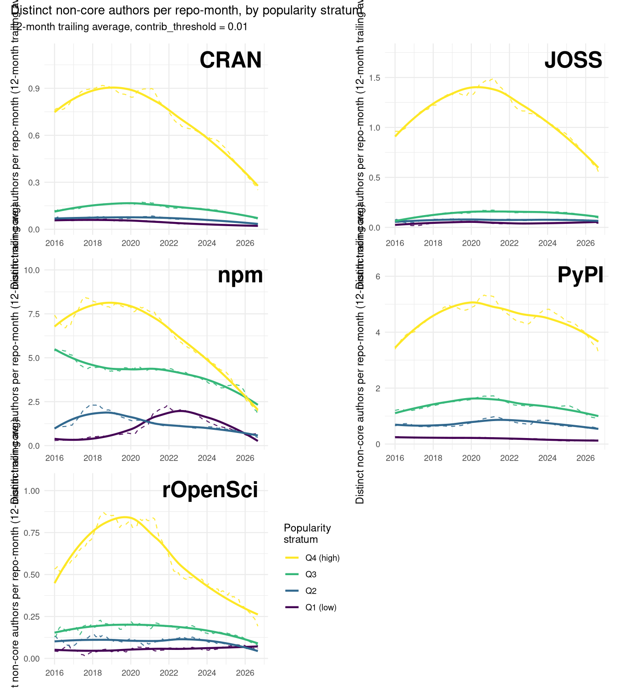
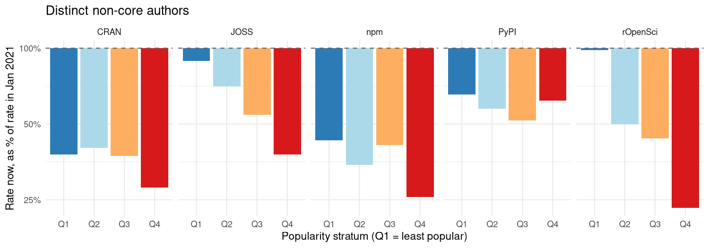
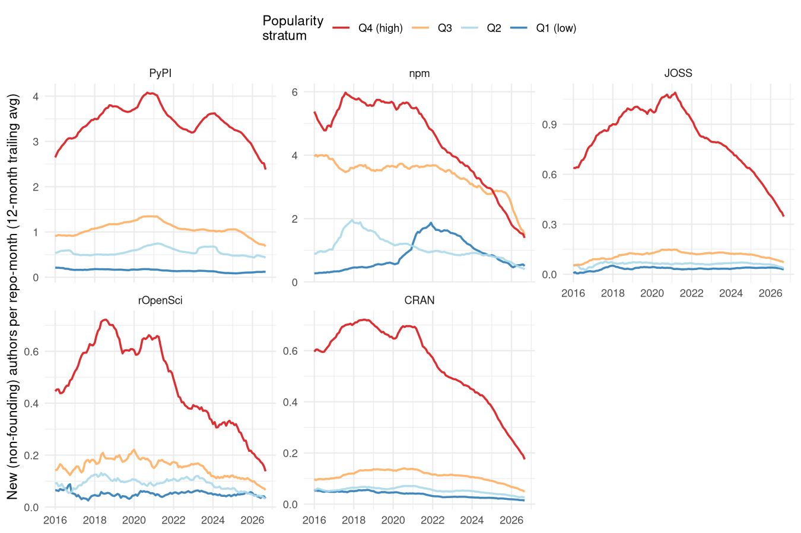
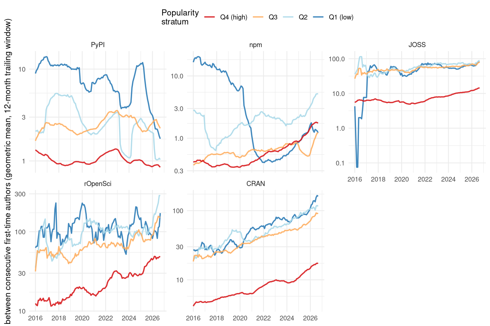
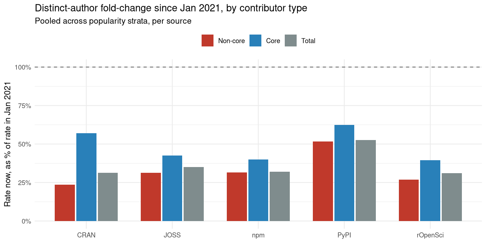
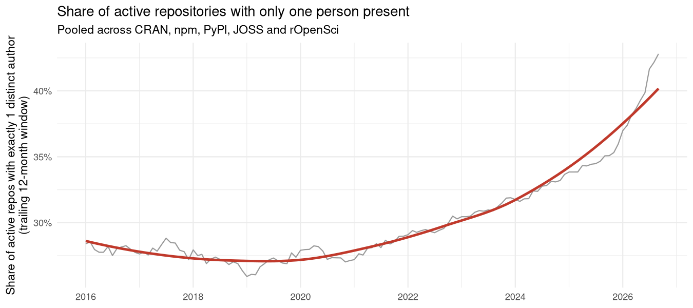
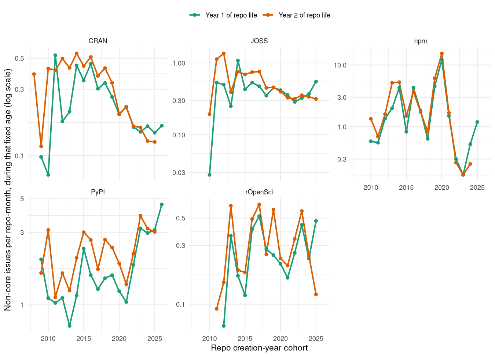
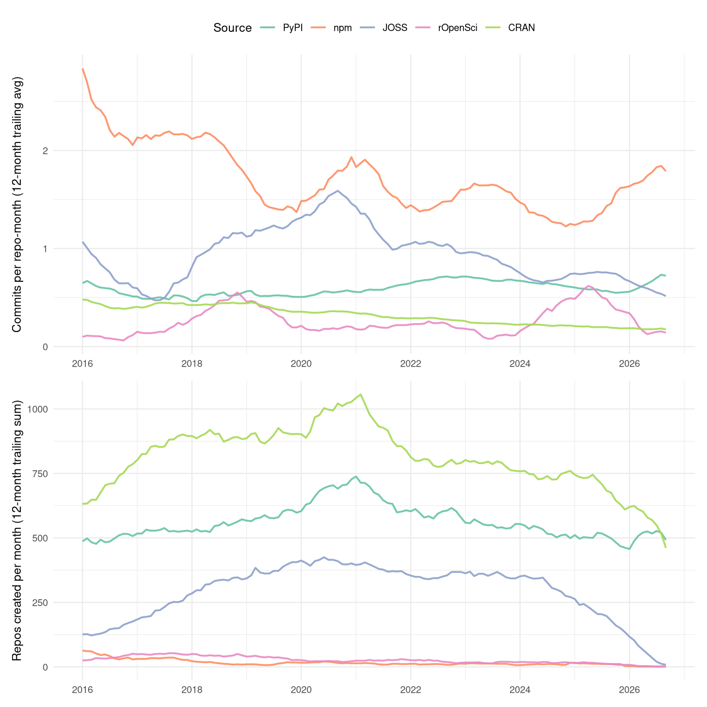

<!--
This is the LIVE source for the "coding-alone" vignette. It is not built
directly by R CMD build/check - it requires repo-data-out/, which is far
too large to ship with the package (see the data-access note in the
vignette itself). Instead it's precompiled once, on a machine that has that
data, into the static vignettes/coding-alone.Rmd that actually ships:

    knitr::knit ("vignettes/coding-alone.Rmd.orig", output = "vignettes/coding-alone.Rmd")

run with the working directory set to vignettes/, so relative paths below
resolve correctly. That committed .Rmd has every chunk already evaluated
(text and figures baked in as static markdown/images), so re-building it
via the usual vignette machinery never needs the data again.
-->

## Bowling alone, coding alone

In 1995, Robert Putnam noticed that more Americans were bowling than ever
before, but the growth was in solo or casual bowling at the expense of
organised, collective blowing. He argued that this was reflective of a broader
collapse of associational habits which used to knit Americans into overlapping
local groups. Clubs, unions, congregations, leagues had been quietly hollowing
out for a generation, not because people had lost interest in the underlying
activity, but because they'd stopped doing it *together*
[@putnam1995bowlingalone; @putnam2000bowlingalone]. The incidental
organizational structure of bowling leagues facilitated repeated contact with
the same loose sets of other people. And that was key to ensuring that a
potentially solitary pastime was actually a key contributor to social
infrastructure.

Open-source software has its own version of a league: public
repositories, with one or two maintainers at their centre and shifting casts of
outsiders who file bugs, ask questions, or leave comments, and in
doing so form part of a community that guides and nurtures ongoing software
development.

People still write code, probably more of it than ever. But this document shows
that the collective structure built around that writing is changing
dramtically. Public software repositories are changing from places of
collective coherence and cohesion to more like mere mirrors of a single
person's work.

## What was measured

The dataset combines five sources - CRAN, npm and PyPI (general package
registries) and JOSS and rOpenSci (two GitHub-based software review
organisations) - matched to their GitHub repositories, with every issue
ever opened on each one fetched via the GitHub API:
3,135,960 issues across
52,461 repositories, spanning
2003–2026.

Three cuts of "who's there" are used below, all built from the same
`contribution` field - each issue author's cumulative share of all
commits ever made to that repository, as of when the data was fetched.
**Non-core** authors are those at or below `contrib_threshold = 0.01`,
the outsider slice used throughout the companion vignette; **core**
authors are everyone above that line; **total** is the two combined,
with no threshold applied at all. Popularity strata (Q1 = least popular
quartile, Q4 = most popular), where used, are computed separately within
each source, from log-scaled downloads (CRAN, npm, PyPI) or GitHub stars
(JOSS, rOpenSci).

The unit of account also comes in two forms. Most of the figures below
extend the companion vignette's **distinct-author density** - not how
many issues a repository received in a given month, but how many
different people filed them, normalised by repo-months of exposure the
same way an issue rate is. The final measure introduced here is simpler
and more direct: for every repository with *any* issue-based activity in
a trailing 12-month window, does that activity involve exactly one
distinct person, or more than one? The share of active repositories
sitting at exactly one is the closest this dataset comes to counting solo
maintainers directly - a repo-count analogue of a bowling league's own
falling membership rolls, rather than of its per-lane activity rate.

Every count in this document, core contributors included, depends on a
person having filed at least one GitHub issue on the repository - that's
the only trace of a "contributor" this dataset can see. Someone who
commits code but never opens an issue (a co-maintainer working entirely
through pull requests, say) is invisible here, in every measure below,
core and total alike. Closing that gap needs real commit-history-based
contributor timelines rather than issue-filing as a proxy for who's
present, and a future update to this analysis is intended to draw on
exactly that. Until then, every count here should be read as a plausible
lower bound on how many people are actually present, not an exact
census - though there's no obvious reason for undercounting silent
committers to manufacture a *decline* specifically, rather than just
shifting every number in this document up by some roughly constant
amount.

## Finding 1: fewer outsiders, counted properly

plot of chunk trend-plots

The shape is the same one the companion vignette found in issue counts: a
rise or plateau through the late 2010s, a peak somewhere in the
2017–2020 window, and an ongoing decline since. That resemblance alone
doesn't prove much - a falling issue rate is mechanically compatible with
a falling author count, since fewer issues can't come from more people
without each of them opening fewer on average. What settles it is
comparing the two fold-changes directly, source by source and stratum by
stratum:

plot of chunk fold-change-plot-authors

Every one of the 20 (source, stratum) cells in this
figure sits below its January-2021 level -
20 out of 20, with no exceptions.
That includes rOpenSci's least-popular quartile, the one cell in the
companion vignette's event-count figure that rose rather than fell:
counted by issues, it reached
124%
of its 2021 rate; counted by distinct authors, the same cell manages only
98%
- essentially flat, not growth. Whatever rOpenSci's peer-review process is
doing for its most obscure packages, it isn't attracting a widening
circle of new people; at best, on this measure, it's holding the existing
circle from shrinking.

Beyond that one cell, the two measures mostly move together, but not
identically: in 15 of the 20 cells,
the distinct-author count has fallen by *more* than the issue count has,
meaning the average non-core author isn't opening noticeably more issues
to compensate for fewer of them showing up - if anything, the opposite.

Distinct-author density, though, still blends two different populations
together: people who've been showing up for years and just keep at it,
and people interacting with a repository for the very first time.
Separating the two needs identifying each author's first-ever appearance
in a repository's issue tracker, and setting aside the very first such
appearance for each repo - its founding author, typically the maintainer
opening the repo's own first issue - as not itself community growth.
What's left is the closest thing this dataset offers to new members
joining a bowling league, tracked the same way as every rate above:
normalised by repo-months of exposure and reported as a 12-month trailing
average.

plot of chunk new-author-rate-plot

The new-arrival rate has fallen in
20 of 20 (source, stratum) cells since
January 2021 - the same near-universal decline Finding 1 found in overall
density. In 17 of those 20 cells, the
new-arrival rate has fallen by *more* than overall density has, meaning
the decline documented above isn't simply existing regulars posting a
little less often; it's disproportionately a shrinking supply of people
showing up for the first time at all.

A monthly rate is still an average over a whole population of
repositories, though, which can make a slow-moving shift feel abstract.
The same underlying events - each repository's authors, ordered by their
own first-ever appearance - support a more direct, and more visceral,
reframing: not "how many new arrivals per month" but "how many days does
a repository actually wait between one new arrival and the next".
Measuring the gap between each first-time author and the one before them,
time-stamped at the moment the *later* one shows up, turns the same
decline into units of elapsed time rather than frequency.

plot of chunk author-interval-plot

The wait has lengthened in 17 of
20 (source, stratum) cells since January 2021 - the same
near-universal direction as the rate-based measures above, just expressed
as time instead of frequency. The least-popular quartile shows this most
starkly, since it's the one with the fewest events to begin with:
CRAN's bottom quartile now waits
2.9x as long between
first-time authors as it did in January 2021, the largest lengthening of
any source in that quartile. A repository's least visible corner isn't
just accumulating new outsiders more slowly - it's going measurably
longer stretches of calendar time hearing from no one new at all.

## Finding 2: the core is thinning too

Everything so far is about the outer circle - the people a project's own
regulars are least likely to notice losing. Putnam's story was never just
about casual drop-in members drifting away, though; league bowling's
membership rolls shrank at every level, core organisers included. The
same `contribution` field this dataset already uses to draw the non-core
line can just as easily draw the opposite one: **core** authors
(`contribution > 0.01`) are the people a project would recognise by name,
and **total** is core and non-core combined, with no threshold at all -
counting literally everyone this dataset can see interacting with a
repository through its issues.

plot of chunk fold-change-plot-bytype

Core headcounts have fallen in every one of the five sources -
5 out of 5 - and so has total headcount, core and
non-core combined -
5 out of 5. Nobody's circle is exempt. What does
differ is degree: in every one of the five sources, the core headcount
has fallen by *less* than the non-core headcount did over the same
period (5 out of 5) - consistent with
attrition working its way inward from a project's edges rather than
hitting the whole population evenly at once, but not with the core being
insulated from it altogether. A repository's inner circle is shrinking
more slowly than its outer one, not staying put while the outer one
empties around it.

## Finding 3: more repositories now hold exactly one person

Findings 1 and 2 are both rate-based: fewer distinct people per
repo-month, averaged across a whole population of repositories. The
plainer, Putnam-shaped question is a repo-count one: out of the
repositories that heard from *anyone* at all in the last year, how many
heard from only one person?

plot of chunk solo-share-plot

In January 2021,
27%
of repositories with any issue-based activity at all in the preceding
year had that activity coming from a single person. By
September 2026, that share had risen to
43%
- not a fixed population getting quieter across the board, but a growing
fraction of it crossing all the way over into having no visible second
person at all. The share was roughly flat, drifting between about a
quarter and a third, from 2016 through 2021; essentially the entire rise
has happened since. Broken out by source, every one of the five moves the
same direction -
5 out of 5 rose:

Table: Share of active repositories with exactly one distinct author, by source

|Source   | Jan 2021| Latest|
|:--------|--------:|------:|
|CRAN     |      36%|    56%|
|JOSS     |      25%|    35%|
|npm      |      19%|    29%|
|PyPI     |      18%|    31%|
|rOpenSci |      22%|    48%|

rOpenSci shows the largest relative jump of the five - not the smallest,
despite housing this dataset's one instance of formal review sustaining
outside engagement in its most obscure packages. Whatever peer review is
doing for a thin slice of rOpenSci's Q1, it hasn't stopped a majority of
rOpenSci repositories overall from crossing into solo territory by the
most recent data.

## Finding 4: not simply projects settling down with age

The same alternative explanation the companion vignette rules out for
issue counts applies here too: repositories might generate less non-core
interest simply because they're older - documentation accumulates, FAQs
get answered once and closed, rough edges get sanded down - independent
of any shared moment in calendar time. Disentangling the two needs the
same age/period/cohort trick: fix a repository's *age* and let *cohort*
(the calendar year that age fell in) vary, so pure maturation predicts
flat lines at a given age regardless of which year that age happened to
fall in, while a shared calendar-time effect predicts later cohorts
showing a lower rate at that same fixed age than earlier ones did.

plot of chunk cohort-age-plot

CRAN, JOSS and npm show the calendar-time signature clearly: at a fixed
early age, the non-core rate falls steadily as the cohort year increases,
roughly halving or more between repositories born in the mid-2010s and
those born in the early 2020s - not what pure maturation predicts. PyPI
and rOpenSci don't show a comparable cohort-driven decline at fixed age,
which is worth flagging rather than smoothing over: whatever combination
of forces is driving the broader pattern doesn't touch every source
through quite the same channel, even though the *outcome* - fewer people
showing up now than five years ago - turns out to be shared by all five.

## Finding 5: popularity offers no protection - if anything the opposite

If the decline were simply outsiders losing interest in open source
generally, it should land on popular and obscure software alike. It
doesn't:

Table: Distinct-author fold-change since Jan 2021, least vs. most popular quartile

|Source   | Least popular (Q1)| Most popular (Q4)| Gap (Q4 − Q1)|
|:--------|------------------:|-----------------:|-------------:|
|rOpenSci |                98%|               23%|          -75%|
|JOSS     |                89%|               38%|          -51%|
|npm      |                43%|               26%|          -17%|
|CRAN     |                38%|               28%|          -10%|
|PyPI     |                66%|               62%|           -4%|

In every one of the five sources, the most popular quartile's headcount
has fallen further below its 2021 baseline than the least popular
quartile's has - the same direction the companion vignette reports for
issue counts, but here without a single source running the other way.
Popularity buys a project more absolute traffic, but it hasn't bought
insulation from this trend; the software with the most outside visibility
to lose is losing proportionally more of it than the software that barely
had any to begin with.

## Finding 6: a direct check against commit history

Everything above is built on issue-filing, which, as noted at the outset,
misses anyone who contributes code without ever opening an issue. Commit
history sidesteps that gap directly: it's a record of code actually
landed on a repository's default branch, independent of whether whoever
landed it ever filed an issue at all. Unlike every rate above, commit
rate shows no material difference across popularity strata, so the top
panel below plots one line per source rather than splitting each source
into quartiles. The bottom panel adds the raw context those per-repo-month
rates are computed against: how many repositories of each source were
themselves created per month, unnormalised, over the same window.

plot of chunk commit-rate-plot

Table: Commits per repo-month, by source, now vs. Jan 2021

|Source   | Jan 2021| Latest| Fold-change|
|:--------|--------:|------:|-----------:|
|JOSS     |     1.43|   0.52|         36%|
|CRAN     |     0.34|   0.18|         51%|
|rOpenSci |     0.18|   0.14|         80%|
|npm      |     1.83|   1.79|         98%|
|PyPI     |     0.56|   0.72|        130%|

The commit-based picture is more mixed than the issue-based one. CRAN,
JOSS and rOpenSci all show a commit rate below their January-2021 level,
in the same direction as every issue-based measure above. npm and PyPI
don't: PyPI's commit rate now sits above its January-2021 level, and
npm's sits close to flat. Three of the five primary sources point the
same direction as Findings 1-5; two of them - both general-purpose
package registries rather than the GitHub-review-oriented JOSS/rOpenSci -
don't. A pattern built entirely on who files an issue and a pattern built
entirely on who lands a commit aren't measuring the same thing, and here
they don't agree everywhere.

## What this looks like from outside this dataset

Nothing in this dataset says why. But the pattern - a shrinking, and
increasingly solitary, pool of participants, hitting visible and obscure
projects alike, reaching core contributors as well as outsiders,
unexplained by projects simply aging - lines up with what's independently
being reported about the people who keep open source running day to day,
in terms that echo Putnam's own more directly than might be expected. A
2024 survey of open-source maintainers found that 61% of them maintain
their project entirely alone, and that unpaid maintainers were
disproportionately likely to be the ones flying solo
[@socket2024solomaintainers]. Tidelift's own 2024 survey of maintainers
found that 60% remain entirely unpaid and nearly 60% have quit, or
seriously considered quitting, a project they maintain, citing competing
life demands, loss of interest, and burnout among the leading reasons
[@tidelift2024maintainer]. In November 2025, Kubernetes' steering and
security committees retired Ingress NGINX - one of the most widely
deployed pieces of cloud-native infrastructure in existence, maintained
for years by one or two people working nights and weekends - after
concluding that no amount of public appeal could attract the additional
help needed to keep it going [@kubernetes2025ingressnginx]. A project
that visible sitting in this dataset's own Q4 is exactly the kind of case
Finding 5 describes: popularity that didn't translate into a growing
base of people ready to share the load.

The newcomer side of the pipeline shows a matching strain from the supply
end. Newcomers have always been hard to retain - a decade-old study of
one large Apache project found fewer than one in five who showed up ever
became long-term contributors, largely depending on whether their first
interaction got a timely, helpful response [@steinmacher2013newcomers].
More recent evidence suggests the on-ramp meant to fix exactly that
problem is itself fraying: a 2026 longitudinal study of "good first
issue" labelling across 37 popular OSS projects found that after holding
steady for three years, the share of issues labelled as newcomer-friendly
began a statistically significant decline starting in January 2024
[@hoshikawa2026goodfirstissue] - maintainers with less time or attention
to spare evidently have less of it left over for curating an on-ramp, on
top of everything else. None of this is a new problem invented by any one
technology; a decade before any of it, Nadia Eghbal's *Roads and
Bridges* was already describing critical open-source infrastructure
sustained by a handful of unpaid volunteers, and arguing that the fix
isn't simply money, because what these projects actually run short of is
people [@eghbal2016roadsbridges].

The decline's timing loosely coincides with two other, independently
documented shifts: GitHub Copilot's move from limited preview to general
availability in mid-2022 [@wikipedia2026copilot], and a well-documented
collapse in Stack Overflow's own new-question volume beginning around the
same time [@orosz2025stackoverflow; @holscher2025stackoverflow] - the
other major venue for the same kind of peer-to-peer technical exchange
this dataset measures. One speculative mechanism worth naming, though
this dataset can't test it directly: if AI coding assistants increasingly
converge developers onto similar solutions and similar code, that kind of
algorithmic monoculture could itself thin out the organic variety of
problems that used to generate an issue or a question in the first place
[@bommasani2022monoculture]. That's one candidate explanation among
several plausible ones, offered as context rather than as something this
dataset can adjudicate - and it would sit alongside, not replace, Putnam's
own preferred explanations for the associational decline he documented:
generational turnover, two-career households leaving less unscheduled
time, and, well before social media, the privatising pull of television
[@putnam2000bowlingalone].

## Caveats

- **Every count in this document depends on issue-filing, not commit
  history**, as explained above - core, non-core and total headcounts
  alike miss anyone who contributes code without ever opening an issue.
  A planned update to this analysis will substitute real commit-based
  contributor timelines for this proxy; the numbers here should be read
  as a plausible lower bound, not an exact census, though there's no
  obvious mechanism by which fixing this would turn any of the declines
  reported above into a rise.
- **Distinct-author density counts author-months, not lifetime-unique
  people.** Someone active in three different months within a trailing
  12-month window is counted three times, once per month - the same
  construction as the underlying issue-rate metric, chosen so the two
  stay directly comparable. This measure can't distinguish a shrinking
  pool of *regulars* from a shrinking stream of one-time drive-by
  contributors; both would produce the same falling density.
- **The per-repo decline is steeper than the decline in total
  participation**, because the population of repositories itself grew
  over the same period: 21,548 primary-source
  repositories exist in this dataset now, against
  13,043 that already existed by January 2021 -
  a 1.7x increase. Raw, unnormalised
  monthly non-core author counts across all five sources combined have
  fallen only to about
  75%
  of their January-2021 level, well short of the roughly
  43%
  median seen per repository. More repositories now compete for a
  shrinking amount of attention per repository - the total pool of
  people engaging with open source hasn't collapsed nearly as sharply as
  any individual project's own share of it has.
- **The solo-repository share (Finding 3) is a repo-count share, not
  normalised by exposure at all**, unlike every other measure in this
  document - it doesn't correct for the same repo-count growth just
  described. It answers a different question on purpose (how many
  repositories, not how much activity per repository), but that also
  means it isn't directly comparable in magnitude to the fold-changes
  reported elsewhere.
- **`contribution` is a lifetime measure, not a point-in-time one**, so
  an issue filed by someone who later became a core maintainer is
  excluded from "non-core" counts even for that earlier issue.
- **Popularity strata reflect current downloads/stars, not historical
  popularity** - stratification here doesn't track a repository's
  popularity trajectory, only its current standing.
- **No direct measure of *why* any individual stopped participating.**
  Nothing here distinguishes burnout, disinterest, AI substitution, or
  simply moving on to other things - the external context above is
  context, not measurement.

## Where this leaves things

Putnam's title image worked because bowling itself wasn't disappearing -
what was disappearing was the league around it, the thing that turned an
individual pastime into a piece of shared civic life. This dataset can't
speak to whether people are writing less code; if anything, the tools
available for writing it alone have only multiplied. What it can speak to
is the collective structure built around that writing, and on every cut
available - non-core outsiders, core contributors, everyone combined, and
the blunter question of how many repositories now involve only one
person at all - that structure has been thinning since around 2021,
across five different ecosystems, unexplained by projects simply
maturing, and unprotected by popularity. The one place this dataset finds
a countervailing force - rOpenSci's formal peer review, sustaining
non-core engagement in its own least-visible packages - doesn't rescue
that same corner of rOpenSci from a rising solo-repository share either.
None of that is proof of any single cause. What it is, is a
structural, five-ecosystem-wide shift from code written and shared among
a loose, overlapping circle of people toward code written and shared by
one person at a time - open source's own version of bowling alone,
showing up in this dataset at almost exactly the same moment outside
observers, from maintainer surveys to a retired Kubernetes component,
have been reporting it from the other side.

## References
