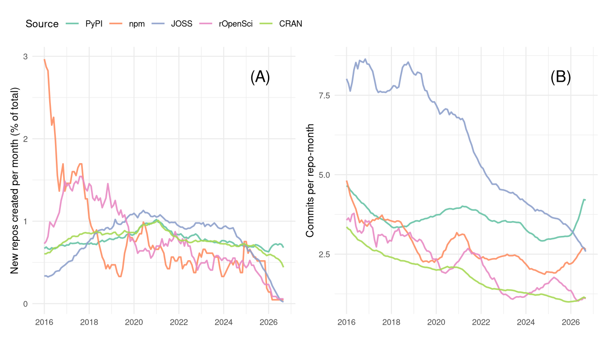
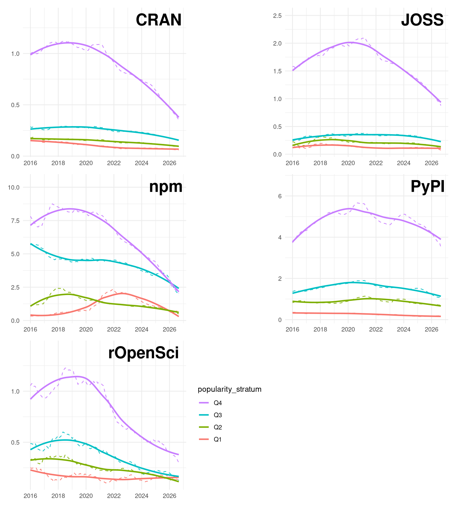
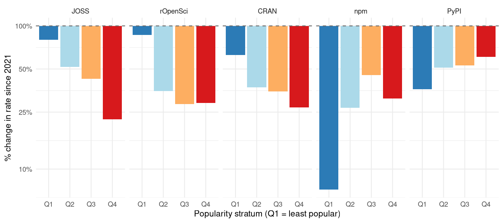
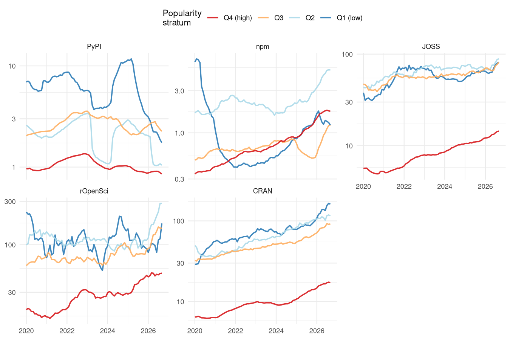
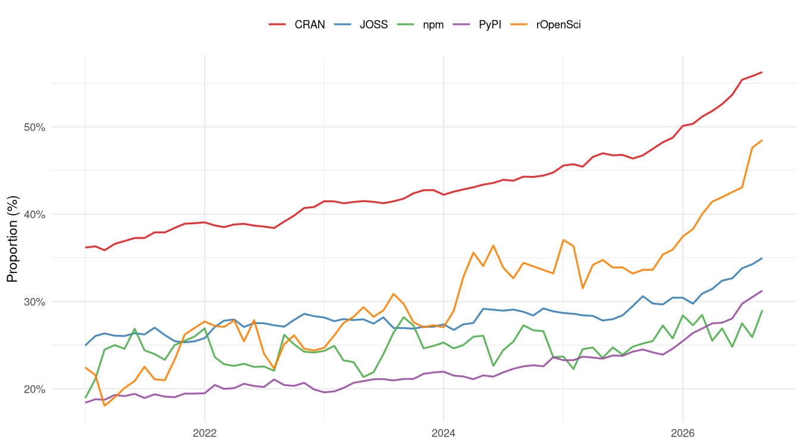
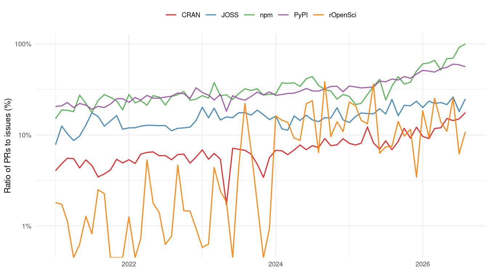
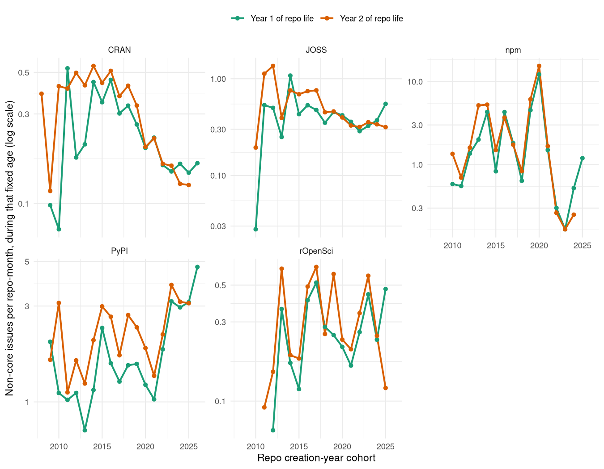

<!--
This is the LIVE source for the "coding-alone" vignette. It is not built
directly by R CMD build/check - it requires repo-data-out/, which is far
too large to ship with the package (see the data-access note in the
vignette itself). Instead it's precompiled once, on a machine that has that
data, into the static vignettes/coding-alone.qmd that actually ships:

    knitr::knit ("vignettes/coding-alone.qmd.orig", output = "vignettes/coding-alone.qmd")

run with the working directory set to vignettes/, so relative paths below
resolve correctly. That committed .qmd has every chunk already evaluated
(text and figures baked in as static markdown/images), so re-building it
via the usual vignette machinery (now the `quarto::html` vignette engine)
never needs the data again.
-->

In 1995, Robert Putnam noticed that more Americans were bowling than ever
before, but the growth was in solo or casual bowling at the expense of
organised, collective bowling. He argued that this was reflective of a broader
collapse of associational habits which used to knit Americans into overlapping
social groups. Local clubs, unions, congregations, leagues had been quietly
hollowing out for a generation, not because people had lost interest in the
underlying activities, but because they'd stopped doing them together
[@putnam1995bowlingalone; @putnam2000bowlingalone]. The incidental
organizational structure of bowling leagues turned out to have been key to the
way a potentially solitary pastime contributed to social cohesion.

Open-source software has its own version of a league: public repositories, with
a few core maintainers and shifting casts of outsiders who ask questions,
report bugs, or leave comments. These communities of contributors guide and
nurture ongoing software development. People still write code, but this
analysis shows that the collective structures that have supported and sustained
that writing are changing dramatically. Public software repositories are
changing from places of social coherence and cohesion to become more like mere
mirrors of a single person's work.

## Why does this matter?

Maybe software coded by increasingly isolated individuals will be just a good
as previous software coded by larger communities building on one another's
ideas? Maybe a bunch of individuals with large enough budgets for billions on
AI tokens will be able to usher in a new golden age of genius software? It's
obviously helpful at the outset to try to figure out whether that's likely to
happen or not.

The first problem in doing that is that good software is not easy to define.
But at least for open-source software, popularity can generally be presumed to
reflect quality. Popular open-source software can generally be presumed to be
good (even though lots of really good software may go unnoticed). And
popularity can be measured, generally by numbers of downloads, as well as by
metrics like numbers of times people have "starred" software repositories on
GitHub.

All of the following analyses use random selections of repositories from
several common software distribution systems, including [npm for
Javascript](https://npmjs.com), [PyPI for Python](pypi.org), [CRAN for
R](https://cran.r-project.org), and two GitHub-based software review
organizations, [JOSS (the Journal of Open-Source
Software)](https://joss.theoj.org), and [rOpenSci](https://ropensci.org). Data
extracted for each of these can show whether larger communities help produce
better software, as measured through popularity.

Relationships between community size and popularity are of course complicated
by the fact that both tend to change and interact over time (ideally through
growing together). Such mutual interactions can easily be statistically
accounted for, to estimate the effects of community size on repository
popularity independent of any influence of repository age on either of those
measures. And doing that reveals the relationships shown in the following
figure:

{#fig-popularity-authors fig-align="center"}

Good software - as measured by popularity - is overwhelmingly produced by
larger communities. This relationship is of course purely correlative, and can
say nothing about whether larger communities actually _cause_ software quality
to increase. But it is nevertheless sufficient to clearly show why this
matters: Software produced by smaller communities tends to be significantly
less popular. This suggests that any decreases in the sizes of communities
producing software will likely be associated with decreases in software
popularity, and quite likely decreases in software quality.

To answer the question this section posed: These analyses matter because good
software emerges from large communities, and anything that works to reduce
community size will also work to reduce software quality. The rest of this
analyses provides various insights in to what appears to be a comprehensive
collapse of open-source communities. 

### What was measured

All data are taken from GitHub, primarily as measures of interaction with
software repositories through "issues". Issues are the place for anybody to ask
questions of software authors, to report bugs, or to request new features.
A corpus of repositories was taken from the five sources described above.

Analyses included every repository reviewed by [JOSS](https://joss.theoj.org)
and [rOpenSci](https://ropensci.org), every package currently on
[CRAN](https://cran.r-project.org), and samples from the other three. Samples
were stratified by popularity to ensure even sampling and representation
regardless of popularity. In total, 3,139,779 issues were analysed across
52,461 repositories.

More popular or prominent repositories attract greater interaction, resulting
in issues being opened more frequently, and from a wider community. To account
for the effects of repository popularity, most of the results are represented
for four popularity strata, taken as quartiles on a logarithmic popularity
scale. The lowest quartile, denoted "Q1", represents the least popular
repositories. Because these generally strongly outnumber popular repositories,
these Q1 values may be generally interpreted to reflect the majority of all
repositories. The "Q4" repositories are the outlying superstar repositories
with enormous numbers of downloads and hundreds of people opening issues. A few
additional statistics were also extracted, and are described alongside the main
analyses.

#### But what about pull requests?

GitHub also implements "pull requests", which allow people to upload their own
code changes and request that they be "merged" with the repository's code.
Pull requests are not the place for most people who simply want to ask
questions, or to request that software be adapted or modified for their own
particular purposes. Pull requests from non-core contributors generally follow
explicit requests in issues. I'll briefly examine pull requests at the end of
this analysis. I'll also show there that pull requests represent only a minor
portion of all interactions with repositories on GitHub, with the rest coming
through issues.

The focus of these analyses is on the primary point of community interactions
with open-source software, and these have always been issues and not pull
requests.

---

## Main Findings

### Finding #1: People are coding less

Although the main focus here is on the demise of open-source communities, all
data also reveal a pervasive decline in coding activity in general. The most
direct measures of coding activity are the creation of new repositories, and
numbers of commits in each. Time series of these two statistics are shown in
the following two panels. Both of these show trends common to most results that
follow, with variable development up until 2020-2021, followed by more
progressive declines. Reflecting these general patterns, many of the results
below only show time series from 2021 onwards. Comparisons are also made
as "step changes" between January 2021 and the present (Oct 2026)

{#fig-commit-rate-plot fig-align="center"}

Decreases in repository creation could of course simply reflect people moving
towards alternative code hosting sites. other than GitHub. Such effects are not
considered further here, but all analyses that follow are derived from software
which (still) identifies GitHub as its primary source, and are therefore
independent of whether or not people are abandoning GitHub for alternative
sites. The rates of monthly commits of @fig-commit-rate-plot are an example.
Most of these rates have declined over the past few years, and directly reflect
genuine declines observed among those people still active on GitHub.

### Finding #2: There Are Fewer Contributors

There are several ways to measures numbers of contributors to open-source
software. Source code itself provides one of the most direct measures,
generally through tracking who made each change. Code-hosting platforms provide
a different approach, through data on repository issues. Anybody (with an
account) can open an issue to ask a simple question. Many who do may not
necessarily end up directly contributing to code at all, while almost all
non-core developers who do contribute code start their first interactions via
issues. Data on issues therefore offers more inclusive insights into
open-source communities than data on direct code contributors.

@fig-trend-plots shows numbers of unique people opening new issues on
repositories for the five software ecosystems. All counts are standardised to
numbers of new issues per repository per month. All of these patterns reveal
consistent changes either side of around 2020. And all of them have
progressively decreased since that time.

{#fig-trend-plots fig-align="center"}

For each software source, lines are shown for the four distributional quartiles
described above. "Q4" represents the relatively few extremely popular packages,
while "Q1" is the quartile of lowest popularity. (And these quartiles are
defined on a logarithmic scale, so there are far more packages in Q1 than in
Q4.)

The next figure (@fig-step-change-authors) shows average declines since Jan
2021 for each software ecosystem and for each popularity quartile. Many of
these declines are more pronounced for the most popular software (Q4), although
PyPI shows the opposite trend, with decreases in numbers of unique issue
authors being less severe for the most popular packages, while npm shows an
intermediate pattern.

{#fig-step-change-authors fig-align="center"}

Total numbers of comments on each issue show a similar pattern
(@fig-step-change-commits), with similarly reversed trends for PyPi as well as
npm. Taken together, these two figures reveal both numbers of issue authors and
numbers of comments per issue have declined severely in all software systems
over the past few years. Only for python packages in PyPI have declines been
less severe for the most popular packages. In all other systems, declines have
either been uniformly more severe for more popular packages or, for npm,
displayed mixed patterns with the most severe declines at both ends of the
popularity spectrum.

{#fig-step-change-commits fig-align="center"}

Relative differences in all statistics to this point are quantified in the
following table of percentage changes since Jan 2021. Although these values
show clear declines in coding itself, both in rates of repository creation and
commits, declines are considerably more severe for metrics of community size.
Coding is decreasing, but community interactions are shrinking even faster.

Table: Percentage changes in statistics of Figs. 1-4, estimated from linear regressions fitted to all data from Jan 2021 across all popularity strata (Repository creation for both JOSS and rOpenSci generally only occurs following rigorous review processes, and so values for these two can't really be directly compared with the other sources, and are likely affected by additional constraints and influences.)

|Source   | Repo creation (%)| Commits (%)| Distinct Authors (%)| Issue Comments (%)|
|:--------|-----------------:|-----------:|--------------------:|------------------:|
|JOSS     |                 -|        -57%|                 -61%|               -84%|
|rOpenSci |                 -|        -56%|                 -63%|               -74%|
|CRAN     |              -38%|        -48%|                 -64%|               -78%|
|npm      |              -55%|        -22%|                 -63%|               -71%|
|PyPI     |              -30%|        -18%|                 -36%|               -51%|

----

### Finding #3: New Authors Are Not Arriving

The rates at which new authors of GitHub issues appear have also progressively
decreased across all software systems (@fig-new-author-rate). In 
18 of those 20 combinations of software
source-by-popularity stratum, the new-arrival rate has fallen by *more* than
overall author density has, meaning the decline documented above isn't simply
existing regulars posting a little less often; it's disproportionately a
shrinking supply of people showing up for the first time at all.

{#fig-new-author-rate fig-align="center"}

The following plot converts those absolute measures to relative scales, to
enable comparison of relative rates of change across the popularity quartiles
for each software source. In almost all cases, decreases in arrival rates of
new authors are most severe for the most popular packages.

{#fig-new-author-step-change fig-align="center"}

An alternative way of examining these decreases in rates of arrival are in
terms of intervals between the arrival of each sequential pair of new authors
(@fig-new-author-intervals).

{#fig-new-author-intervals fig-align="center"}

These rates have also uniformly increased over the past few years. They are
also notably far higher for [CRAN](https://cran.r-project.org),
[JOSS](https://joss.theoj.org), and [rOpenSci](https://ropensci.org), in which
new authors now arrive more than once per month only for the most popular
packages. Only PyPi appears to not suffer this trend, with intervals between
the arrival of new authors progressively decreasing over the past couple of
years.

### Finding #4: Spiralling Towards Solitude

For each person contributing to a repository, GitHub also provides a measure of
their relative overall contribution, measured as numbers of commits to source
code. These relative contribution values were used to arbitrarily distinguish
core contributors to a repository as those contributing a cumulative total of
99% of all commits. Non-core contributors were then identified as those
contributing less than 1% of the cumulative total. While this threshold is
arbitrary, none of the results or conclusions that follow are qualitatively
affected by different values.

Relative decreases in numbers of distinct authors have decreased more for
non-core than for core authors for all software sources
(@fig-step-change-bytype). In all cases, most of the decreases in contributions
observed in @fig-step-change-authors and @fig-step-change-commits reflect
non-core contributors decreasing at faster rates than core contributors.

{#fig-step-change-bytype fig-align="center"}

The combined effect of these decreases must of course be a progression towards
increasing numbers of repositories being maintained by one person only. This is
exactly what @fig-solo-share-plot shows. Taken collectively, 
27% of repositories were effectively
maintained by a single person in January 2021.
By October 2026, that share had risen to
44%.

{#fig-solo-share-plot fig-align="center"}

## What does this mean?

Many aspects of these analyses align with what other people have reported about
the people who keep open source software alive. A 2024 survey of open-source
maintainers found that 61% of them maintain their project entirely alone, and
that unpaid maintainers were disproportionately likely to be working alone
[@socket2024solomaintainers]. A 2024 survey of maintainers by Tidelift found
that 60% remain entirely unpaid and nearly 60% have quit, or seriously
considered quitting, projects they maintain, citing reasons such as competing
life demands, loss of interest, or burnout [@tidelift2024maintainer].

In November 2025, Kubernetes' steering and security committees retired Ingress
NGINX [@kubernetes2025ingressnginx]. This was one of the most widely deployed
pieces of cloud-native infrastructure in existence, and would sit very high in
all "Q4" high-popularity strata here. NGINX had been maintained for years by
voluntary open-source contributors, and yet the exact kinds of declines
observed here manifest in this case to a complete inability to find even a
single person willing to maintain the project.

Good software always evolves, and part of that evolution frequently includes
maintainers searching for other people to continue their work. New maintainers
always emerge from communities of newcomers arriving at a project. GitHub made
it far easier than ever before for newcomers to just magically appear, mostly
through opening issues to ask questions. Many projects actively cultivate an
open and welcoming atmosphere as an attempt to attract as many newcomers as
possible, yet even that practice seems to be declining [@hoshikawa2026].

The real difficulties begin with attempts to retain the interest of newcomers.
A decade-old study of one large Apache project found fewer than one in five
people who initially appeared on software repositories became long-term
contributors [@steinmacher2013newcomers]. A decade before any of these
findings, Nadia Eghbal's _Roads and Bridges_ described the ways by which
critical open-source infrastructure was sustained by a handful of unpaid
volunteers, and argued that the true shortages were always in people rather
than money [@eghbal2016roadsbridges]. Finally, these results also reflect the
well-documented collapse of Stack Overflow as a community platform
[@orosz2025stackoverflow; @holscher2025stackoverflow].

### What about AI?

The declines observed here began several years before the advent of AI as we
now know it. AI has almost certainly contributed, including through mechanisms
such as "algorithmic monoculture" [@bommasani2022monoculture] discouraging
diverse inputs into software. Changes over the last year or two certainly seem
to be accelerated versions or preceding changes, including in [repo creation
rates](#fig-commit-rate-plot), [numbers](#fig-trend-plots) and [arrival
rates](#fig-new-author-rate) of new contributors, and in [solo-author
projects](#fig-solo-share-plot). AI is very likely to have had an influence in
all of these accelerated rates of decline, although after and on top of more
general and broader factors.

There have been many claims of open-source projects "drowning" in a "flood" of
AI-generated pull requests. (None of those are worth citing here, as I can find
no actual data to assert such claims). As described above, first points of
contact for new contributors are very generally issues, with pull requests
(PRs) usually only made after initial discussion within issues. This reflects
ubiquitous human conventions of only doing something for somebody else after
first ascertaining they actually want or need it. There is nothing special
about the general workflow adopted in software development of issue first,
followed by PRs. It reflects the way human interactions are generally
structured. Ask first, and then do.

Data on PRs were also extracted here in the same way as data for issues. The
only thing that does indeed seem to have changed is the ratio of PRs to issues
(@fig-pr-to-issues-ratio). Proportions of PRs have been gradually increasing
since 2021, with observable recent acceleration in some software systems,
most notably in npm and CRAN.

{#fig-pr-to-issues-ratio fig-align="center"}

### Doing before asking

As stated above, most human societies cultivate habits of asking before doing.
Unsolicited pull requests reverse this custom. They represent a comparably more
aggressive step of doing before asking. While causes for such cultural changes
are likely complex, increased social isolation does seem to foster increased
aggression [@twenge2001]. Although coding alone is likely to increase ratios of
PRs to issues, the increases in @fig-pr-to-issues-ratio more likely reveal an
additionally negative influence of AI coding tools.

The large language models that underlie AI coding tools are trained on vast
corpora of primarily online data. And people act differently online than they
do in person. I posit that an even more likely cause for increased PR-to-issue
ratios is the embedding within AI of the widely acknowledged "online
disinhibition effect" [@suler2004].

AI coding tools -- and of course AI in general -- are more reflective of
pathologically disinhibited online behaviour than actual human social behaviour.
Suler's [-@suler2004] original descriptions are insightful:

> [People] don't have to own their own behavior by acknowledging it ... The
> online self becomes a compartmentalized self... the person can avert
> responsibility [in a form of] "emotional hit and run".
>
> [People can] live in an [sic] make-believe dimension, separate and apart from
> the demands and responsibilities of the real world. [They] see their online
> life as a kind of game with rules and norms that don't apply to everyday
> living... They relinquish their responsible [sic] for what happens in a
> make-believe play world that has nothing to do with reality.

Perhaps all of the declines observed here reflect increases in the kinds of
behaviour described by Suler more than 20 years ago. The easier it got to do
everything online, including coding, the more the behaviours of those doing the
coding become disinhibited from their pro-social, in-person behaviour. AI is
just the culmination of that process.

Suler's [-@suler2004] original conclusions were cautiously framed, and
acknowledged a complex interplay between "benign" and "toxic" disinhibition.
More recent research [@chu2026] has demonstrated a reality that lies more to
the toxic than benign side, especially in online spaces dominated by men.
I've [said elsewhere](https://mpadge.eu/blog/machina-machista.html) that,
"_Your AI thinks you're a dude. And that's a problem for everybody who is
not._" These analyses add nuance to that conclusion, by showing how AI coding
assistants are a manifestation of their training being heavily influenced by
the toxically disinhibited expressions of anti-social men.

## What can we do about this?

First and foremost, everything here shows an immediate need to do anything and
everything to cultivate, nurture, and maintain communities. Always seek to
collaborate rather than doing things yourself. Even if you don't know anybody
to collaborate with, inviting collaboration on your open-source repositories
can have a big effect [@hoshikawa2026]. And the results of @chu2026 provide
strong evidence for the pro-social effects of community diversity -- invite and
encourage as many different kinds of people you can.

Perhaps most importantly if you use AI coding assistants, ensure you use them
in socially aware ways. These machines are trained to implement their own
work-arounds to any software issues they encounter. And they often do so
silently. Start with clear instructions in an [`AGENTS.md`
file](https://agents.md/) or similar **NOT** to so that silently, rather to
tell you, to help you as a human being connect with the human developers of
other software. At the very least, never let an AI coding tool open an
unsolicited pull request on any repository you do not know well. That is doing
without asking, which is rude. Always ask first, and do so with your own, human
words. Help to re-establish open-source communities as genuinely collaborative
spaces.

## References {.unnumbered}

::: {#refs}

:::

---

## Appendix {.appendix}

### Projects do not simply settle down with age

Of course, general interest and activity in repositories may simply decrease
over time, and many of the effects observed above may simply reflect process of
"settling down": Documentation gets clarified, many questions have already been
answered, and the need for engagement decreases.

This appendix demonstrates that repository age does not influence the main
conclusions. @fig-cohort-age shows two lines for each software source: One
exclusively for repositories started in the indicated year, and one for
repositories in their second year of life in that year. Any effects of
repository age should manifest in differences between these two lines, and yet
that is not what is observed. In all cases, observed rates of change remain
very similar regardless of repository age. Moreover, replicating this figure
for any of the metrics analysed in the main text yields qualitatively very
similar results. Repository age therefore has little or no qualitative effect
on any of the results shown in the main text.

{#fig-cohort-age fig-align="center"}
