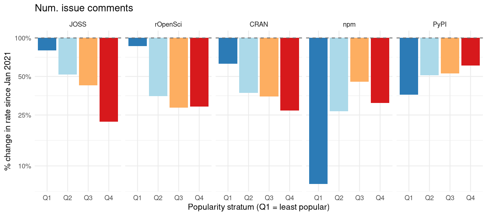

<!--
This is the LIVE source for the "coding-alone" vignette. It is not built
directly by R CMD build/check - it requires repo-data-out/, which is far
too large to ship with the package (see the data-access note in the
vignette itself). Instead it's precompiled once, on a machine that has that
data, into the static vignettes/coding-alone.qmd that actually ships:

    knitr::knit ("vignettes/coding-alone.qmd.orig", output = "vignettes/coding-alone.qmd")

run with the working directory set to vignettes/, so relative paths below
resolve correctly. That committed .qmd has every chunk already evaluated
(text and figures baked in as static markdown/images), so re-building it
via the usual vignette machinery (now the `quarto::html` vignette engine)
never needs the data again.
-->

## Bowling alone, coding alone

In 1995, Robert Putnam noticed that more Americans were bowling than ever
before, but the growth was in solo or casual bowling at the expense of
organised, collective blowing. He argued that this was reflective of a broader
collapse of associational habits which used to knit Americans into overlapping
social groups. Local clubs, unions, congregations, leagues had been quietly
hollowing out for a generation, not because people had lost interest in the
underlying activity, but because they'd stopped doing it *together*
[@putnam1995bowlingalone; @putnam2000bowlingalone]. The incidental
organizational structure of bowling leagues turned out to have been key to the
way a potentially solitary pastime contributed to social cohesion.

Open-source software has its own version of a league: public repositories, with
one or two maintainers at their centre and shifting casts of outsiders who file
bugs, ask questions, or leave comments. These communities of contributors guide
and nurture ongoing software development. People still write code, but this
document shows that the collective structures that have supported and sustained
that writing are changing dramtically. Public software repositories are
changing from places of social coherence and cohesion to become more like mere
mirrors of a single person's work.

## Why does this matter?

Maybe software coded by increasingly isolated individuals will be just a good
as previous software coded by communities building on one another's ideas?
Maybe a bunch of individuals with large enough budgets for billions on AI
tokens will be able to usher in a new golden age of genius software? It's
obviously helpful at the outset to try to figure out whether that's likely to
happen or not.

The first problem in doing that is that good software is not easy to define.
But at least for open-source software, popularity can generally be presumed to
reflect quality. Popular open-source software can be generally presumed to be
good (even though an awful lot of good software may go unnoticed). And
popularity can be measured, generally by numbers of downloads, as well as by
metrics like the number of times people have "starred" software repositories on
GitHub.

All of the following analyses use random selections of repositories from
several common software distribution systems, including [npm for
Javascript](https://npmjs.com), [PyPI for Python](pypi.org), [CRAN for
R](https://cran.r-project.org), and two GitHub-based software review
organizations, [JOSS (the Journal of Open-Source
Software)](https://joss.theoj.org), and [rOpenSci](https://ropensci.org). Data
extracted for each of these can show whether larger communities help produce
better software, as measured through popularity.

Relationships between community size and popularity are of course complicated
by the fact that both tend to change and interact over time (ideally through
growing together). Such mutual interactions can easily be statistically
accounted for, to estimate the effects of community size on repository
popularity independent of any influence of repository age on either of those
measures. And doing that reveals the relationships shown in the following
figure:

{#fig-popularity-authors fig-align="center"}

Good software - as measured by popularity - is overwhelmingly produced by
larger communities. This relationship is of course purely correlative, and can
say nothing about whether larger communities actually _cause_ software quality
to increase. But it is nevertheless sufficient to clearly show why this
matters: Software produced by smaller communities tends to be significantly
less popular. This suggests that any decreases in the sizes of communities
producing software will likely be associated with decreases in software
popularity, quite possibly because of decreases in software quality.

Why do all of the following analyses matter? Because good software requires
large communities.

## What was measured

All data are taken from GitHub, primarily as measures of interaction with
software repositories through "issues". Issues are the place for anybody to ask
questions of software authors, to report bugs, or to request new features.
A corpus of repositories was taken from five sources: three
package-distribution systems of [npm for Javascript](https://npmjs.com), [PyPI
for Python](pypi.org), [CRAN for R](https://cran.r-project.org), and two
GitHub-based software review organizations, [JOSS (the Journal of Open-Source
Software)](https://joss.theoj.org), and [rOpenSci](https://ropensci.org).

Analyses included every repository reviewed by [JOSS](https://joss.theoj.org)
and [rOpenSci](https://ropensci.org), and samples from the other three. Samples
were stratified by popularity (measured as downloads) to ensure even sampling
and representation regardless of popularity. In total,
3,139,779 issues were analysed across
52,461 repositories.

More popular or prominent repositories attract greater interaction, resulting
in issues being opened more frequently, and from a wider community. To account
for the effects of repository popularity, most of the results are represented
for four popularity strata, taken as quartiles on a logarithmic popularity
scale. The lowest quartile, denoted "Q1", represents the least popular
repositories. Because these generally strongly outnumber popular repositories,
these Q1 values may be generally interpreted to reflect the majority of all
repositories. The "Q4" repositories are the outlying superstar repositories
downloaded millions of times, and with hundreds of people opening issues.

The only other important distinct in the data analysed here is between "core"
and "non-core" contributors. Core contributors were identified as the cohort
accounting for 99% of the cumulative share of all commits to a repository.
The none-core contributors which are the focus of this analyses were taken as
the cohort who collectively contributing less than 1%. This 1% threshold was
arbitrarily set, but changing to alternative values like 2 or even 5% has no
qualitative impact of any of the results or conclusions drawn.

A few additional statistics were also extracted, and are described alongside
the main analysis.

## Finding #1: People are coding less

The most direct measures of coding activity are the creation of new
repositories, and numbers of commits in each. Time series of these two
statistics are shown in the following two panels. Both of these show trends
common to most results that follow, with variable development up until
2020-2021, followed by more progressive trends. For that reason, many of the
results shown below only show time series from the January 2021 onwards.
Comparisons are also made as "step changes" between January 2021 and the
present (Sep 2026)

{#fig-commit-rate-plot fig-align="center"}

The decrease in repository creation could of course simply reflect people
moving away from GitHub and towards alternative code hosting sites. Such
effects are not considered further here, but all analyses that follow are
derived from existing GitHub repositories, and are independent of whether or
not people are abandoning GitHub for alternative sites. The rates of monthly
commits of @fig-commit-rate-plot are an example. All of these rates generally decline, although
also at lower rates than equivalent declines in rates of repository creation.
These declines in commit rates are genuine declines observed among those people
still active on GitHub.

## Finding 2: There Are Fewer Contributors

There are several ways to measures numbers of contributors to open-source
software. Source code itself provides one of the most direct measures,
generally through tracking who made each change. Code-hosting platforms provide
a different approach, through data on repository issues. Anybody (with an
account) can open an issue to ask a simple question. Many who do may not
necessarily end up directly contributing to code at all, and so data on issues
offers more inclusive insights into larger communities beyond direct code
contributors.

The following graphs show numbers of unique people opening new issues on
repositories for the five software ecosystems. All counts are standardised to
numbers of new issues per repository. All of these patterns reveal consistent
changes either side of around 2020. And all of them have progressively
decreased since that time.

{#fig-trend-plots fig-align="center"}

For each software source, lines are shown for the four distributional quartiles
described above. "Q4" represents the relatively few extremely popular packages,
while "Q1" is the quartile of lowest popularity. (And these quartiles are
defined on a logarithmic scale, so there are far more packages in Q1 than in
Q4.)

The next figure (@fig-step-change-authors) shows average declines since Jan
2021 for each software ecosystem and for each popularity quartile. Many of
these declines are more pronounced for the most popular software (Q4), although
PyPI shows the opposite trend, with decreases in numbers of unique issue
authors being less severe for the most popular packages, while npm shows an
intermediate pattern.

{#fig-step-change-authors fig-align="center"}

Total numbers of comments on each issue show a similar pattern
(@fig-step-change-commits), with similarly reversed trends for PyPi as well as
npm.

{#fig-step-change-commmits fig-align="center"}

Relative differences in all statistics to this point are quantified in the
following table of percentage change in both rates from Jan 2021. (Repository
creation for both JOSS and rOpenSci generally only occurs following rigorous
review processes, and so values for these two can't really be directly compared
with the other sources, and are likely affected by additional constraints and
influences.)

Table: Percentage changes in statistics of Figs. 1-4, estimated from linear regressions fitted to all data from Jan 2021 across all popularity strata

|Source   | Repo creation (%)| Commits (%)| Distinct Authors (%)| Issue Comments (%)|
|:--------|-----------------:|-----------:|--------------------:|------------------:|
|JOSS     |              -73%|        -56%|                 -61%|               -83%|
|rOpenSci |              -78%|        -54%|                 -61%|               -71%|
|CRAN     |              -38%|        -49%|                 -64%|               -78%|
|npm      |              -55%|        -22%|                 -63%|               -70%|
|PyPI     |              -29%|        -18%|                 -36%|               -50%|

----

## Finding #3: New Authors Are Not Arriving

The rates at which new authors of GitHub issues appear have also progressively
decreased across all software systems (@fig-new-author-rate). In 
17 of those 20 combinations of software
source-by-popularity stratum, the new-arrival rate has fallen by *more* than
overall author density has, meaning the decline documented above isn't simply
existing regulars posting a little less often; it's disproportionately a
shrinking supply of people showing up for the first time at all.

{#fig-new-author-rate fig-align="center"}

The following plot converts those absolute measures to relative scales, to
enable comparison of relative rates of change across the popularity quartiles
for each software source. In almost all cases, decreases in arrival rates of
new authors are most severe for the most popular packages.

{#fig-new-author-step-change fig-align="center"}

An alternative way of examining these decreases in rates of arrival are in
terms of intervals between the arrival of each sequential pair of new authors
(@fig-new-author-intervals).

{#fig-new-author-intervals fig-align="center"}

## Finding 4: the core is thinning too

For each person contributing to a repository, GitHub also provides a measure of
their relative overall contribution, measured as numbers of commits to source
code. These relative contribution values were used to arbitrarily distinguish
core contributors to a repository as those contributing a cumulative total of
99% of all commits. Non-core contributors were then identified as those
contributing less than 1% of the cumulative total. While this threshold is
arbitrary, none of the results or conclusions that follow are qualitatively
affected by different values.

First, relative decreases in numbers of distinct authors have decreased more
for non-core than for core authors for all software sources
(@fig-step-change-bytype).

{#fig-step-change-bytype fig-align="center"}

Table: Percentage changes in rates of new author arrival, estimated from Jan 2021 across all popularity strata

|Source   | Total (%)| Core (%)| Non-Core (%)|
|:--------|---------:|--------:|------------:|
|CRAN     |      -74%|     -43%|         -76%|
|JOSS     |      -69%|     -58%|         -69%|
|npm      |      -63%|     -60%|         -68%|
|PyPI     |      -38%|     -38%|         -48%|
|rOpenSci |      -71%|     -61%|         -73%|

Core headcounts have fallen in every one of the five sources -
5 out of 5 - and so has total headcount, core and
non-core combined -
5 out of 5. Nobody's circle is exempt. What does
differ is degree: in every one of the five sources, the core headcount
has fallen by *less* than the non-core headcount did over the same
period (5 out of 5) - consistent with
attrition working its way inward from a project's edges rather than
hitting the whole population evenly at once, but not with the core being
insulated from it altogether. A repository's inner circle is shrinking
more slowly than its outer one, not staying put while the outer one
empties around it.

## Finding 3: more repositories now hold exactly one person

Findings 1 and 2 are both rate-based: fewer distinct people per
repo-month, averaged across a whole population of repositories. The
plainer, Putnam-shaped question is a repo-count one: out of the
repositories that heard from *anyone* at all in the last year, how many
heard from only one person?

{#fig-solo-share-plot fig-align="center"}

Overall in January 2021,
27%
of repositories with any issue-based activity at all in the preceding
year had that activity coming from a single person. By
September 2026, that share had risen to
43%
- not a fixed population getting quieter across the board, but a growing
fraction of it crossing all the way over into having no visible second
person at all.

## Finding 4: not simply projects settling down with age

The same alternative explanation the companion vignette rules out for
issue counts applies here too: repositories might generate less non-core
interest simply because they're older - documentation accumulates, FAQs
get answered once and closed, rough edges get sanded down - independent
of any shared moment in calendar time. Disentangling the two needs the
same age/period/cohort trick: fix a repository's *age* and let *cohort*
(the calendar year that age fell in) vary, so pure maturation predicts
flat lines at a given age regardless of which year that age happened to
fall in, while a shared calendar-time effect predicts later cohorts
showing a lower rate at that same fixed age than earlier ones did.

{#fig-cohort-age fig-align="center"}

CRAN, JOSS and npm show the calendar-time signature clearly: at a fixed
early age, the non-core rate falls steadily as the cohort year increases,
roughly halving or more between repositories born in the mid-2010s and
those born in the early 2020s - not what pure maturation predicts. PyPI
and rOpenSci don't show a comparable cohort-driven decline at fixed age,
which is worth flagging rather than smoothing over: whatever combination
of forces is driving the broader pattern doesn't touch every source
through quite the same channel, even though the *outcome* - fewer people
showing up now than five years ago - turns out to be shared by all five.

## What this looks like from outside this dataset

Nothing in this dataset says why. But the pattern - a shrinking, and
increasingly solitary, pool of participants, hitting visible and obscure
projects alike, reaching core contributors as well as outsiders,
unexplained by projects simply aging - lines up with what's independently
being reported about the people who keep open source running day to day,
in terms that echo Putnam's own more directly than might be expected. A
2024 survey of open-source maintainers found that 61% of them maintain
their project entirely alone, and that unpaid maintainers were
disproportionately likely to be the ones flying solo
[@socket2024solomaintainers]. Tidelift's own 2024 survey of maintainers
found that 60% remain entirely unpaid and nearly 60% have quit, or
seriously considered quitting, a project they maintain, citing competing
life demands, loss of interest, and burnout among the leading reasons
[@tidelift2024maintainer]. In November 2025, Kubernetes' steering and
security committees retired Ingress NGINX - one of the most widely
deployed pieces of cloud-native infrastructure in existence, maintained
for years by one or two people working nights and weekends - after
concluding that no amount of public appeal could attract the additional
help needed to keep it going [@kubernetes2025ingressnginx]. A project
that visible sitting in this dataset's own Q4 is exactly the kind of case
Finding 5 describes: popularity that didn't translate into a growing
base of people ready to share the load.

The newcomer side of the pipeline shows a matching strain from the supply
end. Newcomers have always been hard to retain - a decade-old study of
one large Apache project found fewer than one in five who showed up ever
became long-term contributors, largely depending on whether their first
interaction got a timely, helpful response [@steinmacher2013newcomers].
More recent evidence suggests the on-ramp meant to fix exactly that
problem is itself fraying: a 2026 longitudinal study of "good first
issue" labelling across 37 popular OSS projects found that after holding
steady for three years, the share of issues labelled as newcomer-friendly
began a statistically significant decline starting in January 2024
[@hoshikawa2026goodfirstissue] - maintainers with less time or attention
to spare evidently have less of it left over for curating an on-ramp, on
top of everything else. None of this is a new problem invented by any one
technology; a decade before any of it, Nadia Eghbal's *Roads and
Bridges* was already describing critical open-source infrastructure
sustained by a handful of unpaid volunteers, and arguing that the fix
isn't simply money, because what these projects actually run short of is
people [@eghbal2016roadsbridges].

The decline's timing loosely coincides with two other, independently
documented shifts: GitHub Copilot's move from limited preview to general
availability in mid-2022 [@wikipedia2026copilot], and a well-documented
collapse in Stack Overflow's own new-question volume beginning around the
same time [@orosz2025stackoverflow; @holscher2025stackoverflow] - the
other major venue for the same kind of peer-to-peer technical exchange
this dataset measures. One speculative mechanism worth naming, though
this dataset can't test it directly: if AI coding assistants increasingly
converge developers onto similar solutions and similar code, that kind of
algorithmic monoculture could itself thin out the organic variety of
problems that used to generate an issue or a question in the first place
[@bommasani2022monoculture]. That's one candidate explanation among
several plausible ones, offered as context rather than as something this
dataset can adjudicate - and it would sit alongside, not replace, Putnam's
own preferred explanations for the associational decline he documented:
generational turnover, two-career households leaving less unscheduled
time, and, well before social media, the privatising pull of television
[@putnam2000bowlingalone].

## Where this leaves things

Putnam's title image worked because bowling itself wasn't disappearing -
what was disappearing was the league around it, the thing that turned an
individual pastime into a piece of shared civic life. This dataset can't
speak to whether people are writing less code; if anything, the tools
available for writing it alone have only multiplied. What it can speak to
is the collective structure built around that writing, and on every cut
available - non-core outsiders, core contributors, everyone combined, and
the blunter question of how many repositories now involve only one
person at all - that structure has been thinning since around 2021,
across five different ecosystems, unexplained by projects simply
maturing, and unprotected by popularity. The one place this dataset finds
a countervailing force - rOpenSci's formal peer review, sustaining
non-core engagement in its own least-visible packages - doesn't rescue
that same corner of rOpenSci from a rising solo-repository share either.
None of that is proof of any single cause. What it is, is a
structural, five-ecosystem-wide shift from code written and shared among
a loose, overlapping circle of people toward code written and shared by
one person at a time - open source's own version of bowling alone,
showing up in this dataset at almost exactly the same moment outside
observers, from maintainer surveys to a retired Kubernetes component,
have been reporting it from the other side.

## References
