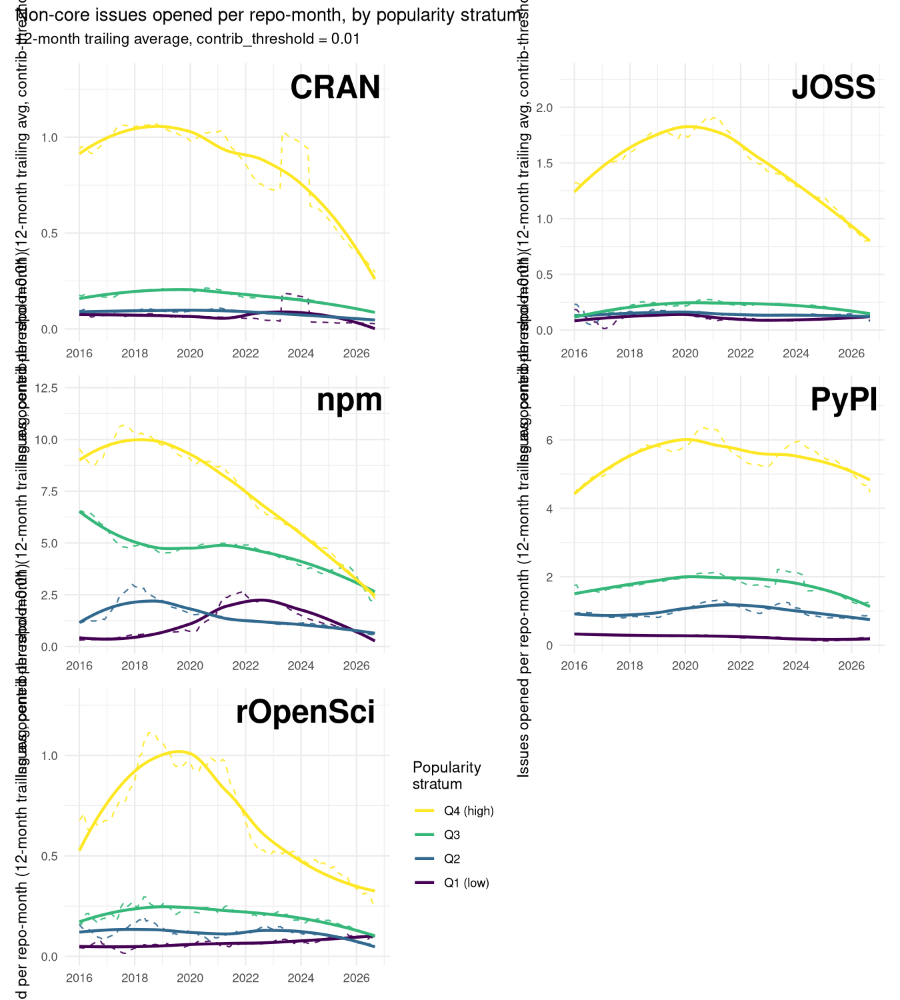
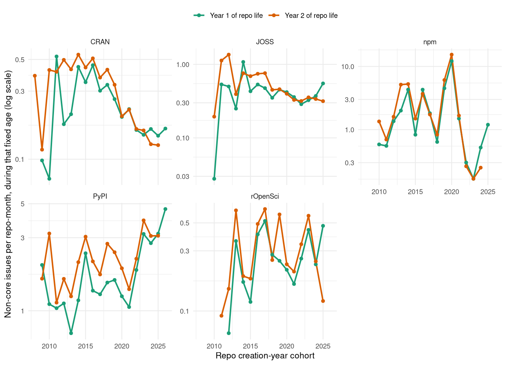
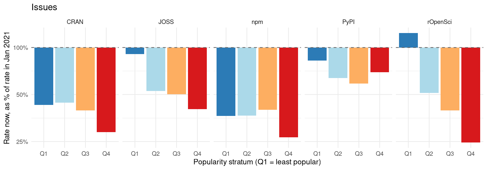
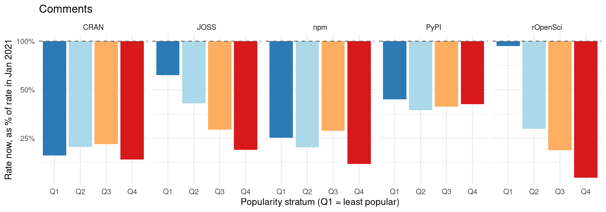
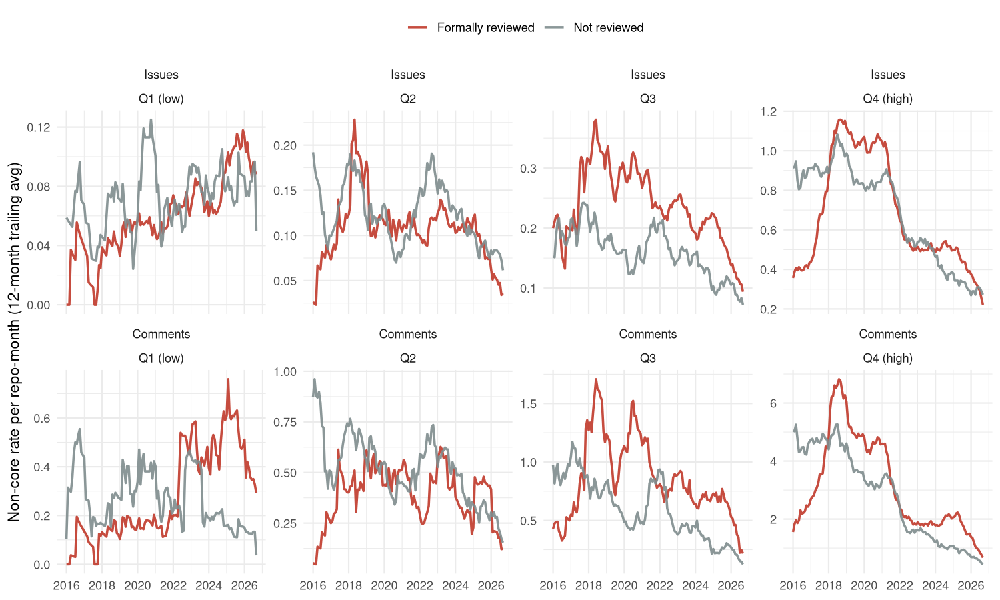
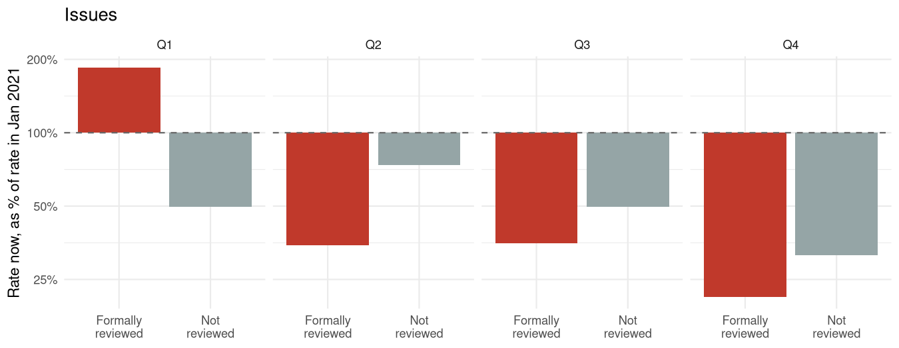
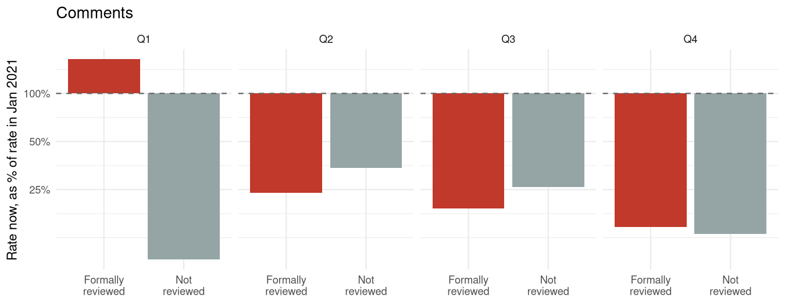

<!--
This is the LIVE source for the "review-dividend" vignette. It is not built
directly by R CMD build/check - it requires repo-data-out/, which is far too
large to ship with the package (see the data-access note in the vignette
itself). Instead it's precompiled once, on a machine that has that data,
into the static vignettes/review-dividend.Rmd that actually ships:

    knitr::knit ("vignettes/review-dividend.Rmd.orig", output = "vignettes/review-dividend.Rmd")

run with the working directory set to vignettes/, so relative paths below
resolve correctly. That committed .Rmd has every chunk already evaluated
(text and figures baked in as static markdown/images), so re-building it
via the usual vignette machinery never needs the data again.
-->

This vignette draws on a large, locally-fetched dataset
(`repo-data-out/`: every GitHub issue ever opened on ~50,000 repositories
across CRAN, npm, PyPI, JOSS and rOpenSci) that is far too large to ship
with the package itself. The vignette you're reading is precompiled from
that data - see `vignettes/review-dividend.Rmd.orig` in the package
source if you want to re-run the analysis yourself once the underlying
data is available (via Git LFS) from the package repository.

## The pattern, and the one exception

Open-source contribution has always been unequal — a small number of
contributors account for the overwhelming majority of activity on most
projects, a pattern documented well before any of what follows
[@chelkowski2016inequalities; @louridas2008powerlaws]. This analysis isn't
about that inequality directly. It's about a narrower, more specific
quantity: how much a repository hears from people who *aren't* its
regular contributors — outsiders filing issues or leaving comments, the
closest available proxy for organic, community-sourced interest in a
piece of software, as opposed to its maintainers talking to themselves or
to each other.

Across five major open-source ecosystems — CRAN, npm and PyPI (general
package registries) and JOSS and rOpenSci (two GitHub-based software
*review* organisations) — that quantity has been falling for years, and
falling further for already-popular software than for obscure software.
That second part runs against the naive expectation that popular projects,
with more users and more visibility, would be comparatively insulated. One
exception to the whole pattern stands out: among rOpenSci's *least*
popular packages, non-core engagement hasn't been falling at all — but
only for the subset of those packages that went through rOpenSci's
structured public peer-review process. Split rOpenSci's obscure packages
into reviewed and non-reviewed, and the "exception" turns out to belong
entirely to one of those two groups. That split, and what it does and
doesn't extend to, is what this document builds toward.

## What was measured

The dataset combines the five sources above, matched to their GitHub
repositories, with every issue ever opened on each one fetched via the
GitHub API: 3,135,960 issues across
52,461 repositories, spanning
2003–2026.

Two quantities are tracked per issue, for two different reasons. **Issues**
— new threads opened against a repository — are the primary metric
throughout: opening an issue is an active, initiating act, the clearest
available signal that someone outside the project bothered to show up.
**Comments** — replies added to already-open issues — are used
throughout as a secondary, confirmatory metric: they capture a different
kind of engagement (continuing a conversation rather than starting one),
so agreement between the two is a check that a pattern isn't an artifact
of how one particular metric happens to be counted.

For both metrics, **non-core** issues/comments — those from an author
whose cumulative commit history on that repository is at most 1% of all
commits ever made to it (`contrib_threshold = 0.01`) — are counted per
calendar month, divided by the number of months the repository has
existed, giving a **rate per repo-month**, reported throughout as a
12-month trailing average to smooth short-term noise. Each source's
repositories are split into four **popularity strata** (Q1 = least
popular quartile, Q4 = most popular) by log-scaled downloads (CRAN, npm,
PyPI) or GitHub stars (JOSS, rOpenSci) — necessarily relative to each
source's own distribution, since a top-quartile CRAN package and a
top-quartile npm package don't represent the same absolute popularity.

rOpenSci carries one further piece of information the other four sources
don't: whether a package went through rOpenSci's structured, public
software review process before or shortly after joining the organisation.
Of the 357 rOpenSci repositories
used here, 230 were formally reviewed and
127 were not — including, within the
least-popular quartile alone, 76 reviewed against
25 non-reviewed. That comparison is what the second
half of this document turns on.

## Finding 1: a shared decline, five ecosystems

Plotting each source's non-core issue rate since 2016, split by popularity
stratum, a common shape recurs: a rise or roughly flat period through the
late 2010s, a peak somewhere in the 2017–2020 window depending on source,
and a decline since that is still ongoing in the most recent data.

plot of chunk trend-plots

Shown here as issues, the primary metric; the fold-change comparison in
[Finding 3](#finding-3-the-decline-favours-the-obscure) below confirms
comments follow the same trajectory.

Nothing in this dataset directly measures *why*. The decline's timing
loosely coincides with two independently documented external shifts over
the same window: GitHub Copilot's move from limited preview to general
availability in mid-2022 [@wikipedia2026copilot], and a well-documented
collapse in Stack Overflow's own new-question volume beginning around the
same time [@orosz2025stackoverflow; @holscher2025stackoverflow] — the
other major venue for the same kind of peer-to-peer technical exchange.
That coincidence is worth noting, but this dataset can't adjudicate
between "AI assistants substituting for asking a human", "a broader
retreat from social coding platforms in general", or some third
explanation. What it *can* do is establish some things the decline is
*not*, and identify where — if anywhere — it doesn't hold. Both of those
are more tractable questions, and the rest of this document is organised
around them.

## Finding 2: not simply repositories getting older

One obvious alternative explanation for a falling issue rate is that it
has nothing to do with any shared moment in time: repositories might
simply generate less non-core interest as they themselves age —
documentation accumulates, FAQs settle into closed issues, rough edges
get sanded down — and every repository's age and calendar time move in
the same direction, so the two are easy to confound in a plot against
calendar time alone.

The fix is a standard age/period/cohort trick: fix a repository's *age*
(e.g. its first or second year of life) and let *cohort* — the calendar
year that age happened to fall in — vary instead. Pure maturation
predicts a repository's own first year of life should look much the same
regardless of which calendar year that first year happened to be. A
shared, calendar-time-specific effect instead predicts later cohorts
showing a *lower* rate at that same fixed age than earlier cohorts did,
even though both are equally young when measured.

plot of chunk cohort-age-plot

CRAN, JOSS and npm all show the calendar-time signature: at a fixed
early age, non-core issue rates decline fairly steadily as the cohort
year increases, roughly halving or more between repositories born in the
mid-2010s and those born in the early 2020s. That's not compatible with
pure maturation, which predicts flat lines across cohorts at a fixed age.
PyPI and rOpenSci are the two exceptions here too: neither shows a
comparable cohort-driven decline at fixed age — PyPI's fixed-age rate is,
if anything, no lower for its most recent cohorts than its oldest ones,
and rOpenSci's is noisy but shows no clear trend in either direction. The
same two sources that will turn out to have the least straightforward
relationship with the "most popular falls furthest" pattern below already
look different in this maturation check — a hint, followed up on next,
that something else is going on in at least one of them.

## Finding 3: the decline favours the obscure {#finding-3-the-decline-favours-the-obscure}

If the decline above were simply a story about outsiders losing interest
in open source generally, it should hit popular and obscure software
alike. Comparing each stratum's rate today against a fixed reference
point — January 2021, chosen to sit after each source's initial ramp-up
but before the steepest part of the decline, avoiding cherry-picking each
stratum's own noisier peak — shows it doesn't:

plot of chunk fold-change-plot-issues

plot of chunk fold-change-plot-comments

In CRAN, JOSS, npm and rOpenSci, the *most* popular quartile has fallen
furthest, not the least popular one. CRAN's Q4 sits at
29%
of its January-2021 rate versus Q1's
43%;
JOSS's Q4 is at
40%
versus Q1's
91%;
and rOpenSci's Q4 is at
25%
while its Q1 has, on net, *risen* to
124%
of its 2021 level. Comments (second figure) show the same ordering within
every source, generally with a larger drop at every stratum — comments
are the more discretionary of the two metrics, so a bigger fall there is
consistent with, rather than contradicting, the issues-based picture.
PyPI is the one source that doesn't fit this stratum ordering: its most
popular quartile has fallen *less* than its least popular one, the
reverse of the other four sources. This dataset doesn't explain why PyPI
runs the other way; it's reported here as a genuine cross-source
divergence rather than folded into the general pattern.

rOpenSci's rising Q1 is the sharpest anomaly in either figure — the
only cell, across five sources, two metrics and four strata, that
increased rather than fell. The rest of this document is about that one
cell.

## Finding 4: peer review, and where its effect stops

rOpenSci runs (almost all of) its packages through a structured, public
peer-review process, on top of or independent from the version control
and organisational structure any GitHub-hosted project already has —
a distinction with no real counterpart in CRAN, npm, or (in the same
form) JOSS. Whether a given rOpenSci repository was formally reviewed is
recorded per-repository in this dataset, which makes it possible to test
directly whether Q1's rise is a property of rOpenSci's least-popular
packages generally, or of a specific subset of them.

Splitting rOpenSci's non-core rate by review status, separately within
each popularity stratum, answers it:

plot of chunk ropensci-reviewed-trend

plot of chunk ropensci-reviewed-foldchange-issues

plot of chunk ropensci-reviewed-foldchange-comments

In Q1, the two groups move in opposite directions. Formally reviewed Q1
packages' non-core issue rate rose to
185%
of its January-2021 level, while non-reviewed Q1 packages fell to
50%
— back in line with the broad decline seen everywhere else in this
dataset. Comments show an even sharper version of the same split:
reviewed Q1 packages rose to
164%
of their 2021 comment rate, while non-reviewed Q1 packages collapsed to
just
9%.
Q1's "exception" isn't a property of rOpenSci's obscure packages in
general — it belongs specifically to the ones that went through formal
review.

That doesn't extend to the rest of the popularity distribution, and it's
worth being direct about that rather than quietly narrowing the claim
after the fact. In Q2, Q3 and Q4, reviewed packages don't show a
protective effect at all — if anything they fell by as much or more than
their non-reviewed counterparts in the same stratum, for both issues and
comments. Whatever review is doing in Q1, it isn't a general "reviewed
packages hold up better" effect across rOpenSci as a whole; it's confined
to the tier of packages with essentially no organic visibility of their
own to begin with.

That confinement is also the most plausible reading of the mechanism.
rOpenSci's review pipeline puts a brand-new, still-obscure package in
front of reviewers and, via rOpenSci's public directory, blog, and
community channels, a wider audience than its own download or star count
would otherwise attract — a standing source of outside attention that an
equally obscure CRAN or npm package simply has no equivalent of. For a
package that's already popular, that additional visibility channel adds
comparatively little, since popularity itself is already doing that job.
For a package with hardly any visibility of its own, the review pipeline
may be close to the *only* channel generating any outside attention at
all — which would explain both why the effect appears, and why it appears
exactly where it does.

## Caveats

- **Review status isn't randomly assigned.** Packages that go through
  rOpenSci's review process may differ systematically from those that
  don't, in ways unrelated to the review process itself — authors willing
  to submit to public review may already be more embedded in the
  rOpenSci community, more responsive to issues, or more actively
  promoting their own package, independent of anything review itself
  does. This dataset can establish that the Q1 split lines up with
  review status; it can't fully rule out that some of what's attributed
  to review is really a selection effect among the people who seek it
  out.
- **`contribution` is a lifetime measure, not a point-in-time one.** An
  issue filed by someone who later became a core maintainer is excluded
  from "non-core" counts even for that earlier issue, because
  `contribution` is computed from an author's *total* commit history at
  fetch time rather than their history as of that issue's date.
- **Popularity strata reflect current downloads/stars, not historical
  popularity.** Some of today's most-popular repositories weren't always
  that popular; stratification here doesn't track a repository's
  popularity trajectory over time, only its current standing.
- **No direct measure of AI usage, or of any other candidate cause of the
  broad decline in Finding 1.** Nothing in this dataset records whether
  any specific user, issue, or repository involved AI assistance, and the
  timing-based context offered there is exactly that — context, not a
  measurement.

## Where this leaves things

Most of open source's recent history of non-core, community-sourced
engagement, across five different ecosystems and two different ways of
measuring it, points the same direction: down, for years, and further
down for already-popular software than for obscure software. Repository
aging doesn't account for it in the three sources where it's cleanest.
One specific, identifiable mechanism — rOpenSci's formal peer-review
process — is the only thing in this entire dataset that measurably
counteracts it, and it does so in exactly the place organic visibility is
thinnest to begin with, not across the board. That's a narrower claim
than "peer review sustains open source," but it's also a sharper and more
useful one: a structural intervention that manufactures outside attention
can apparently substitute for the attention obscure software doesn't
generate on its own — while for software that already gets that attention
some other way, the same intervention doesn't obviously do anything at
all.

## References
